# Source: https://x.com/0xValkyrie_ai/status/2015441632536186977?s=20


---

[](/0xValkyrie_ai)

[有志出海](/0xValkyrie_ai)

[@0xValkyrie\_ai](/0xValkyrie_ai)

[](/0xValkyrie_ai/article/2015441632536186977/media/2015441126770216960)

实测最新的Claude code安装，遗漏这一步， 将无法切换第三方模型

14

99

412

[21万](/0xValkyrie_ai/status/2015441632536186977/analytics)

最近帮同事安装Claude code的时候踩坑， 以为装Claude code 就呼吸一样简单， 但是最新的Claude code 安装和以前不一样了，如果遗漏这步就一直无法切换到第三方模型。

花了将近半小时才帮同事的Claude code 安装， 把踩的坑也顺带记录下。

1. 安装Claude Code
================

1.1 到node.js 官网（

<https://nodejs.org/en/download>

）下载对应系统的node.js 版本安装，

[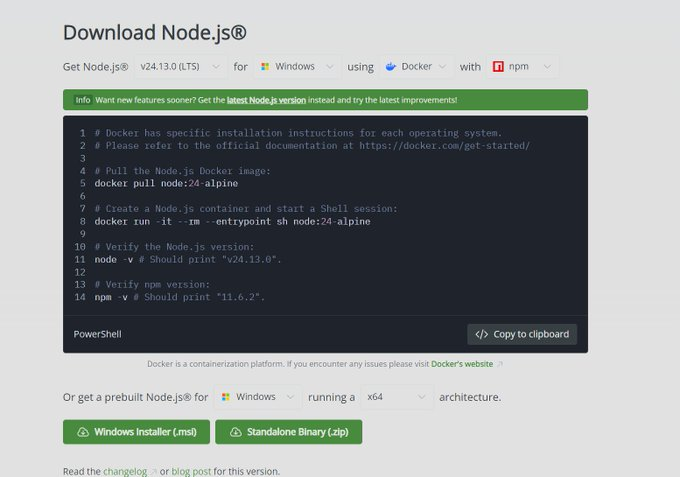](/0xValkyrie_ai/article/2015441632536186977/media/2015337380480499712)

1.2 安装完成以后，打开Powershell，输入 node -v 和 npm -v 验证是否已经成功安装了node 和npm

powershell

```
node -v
npm -v
```

[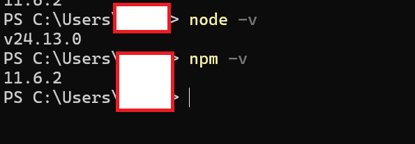](/0xValkyrie_ai/article/2015441632536186977/media/2015342985366441984)

1.3 安装完成以后， 继续在powershell 下面输入下面的命令,开始正式安装cluade code。

```
npm install -g @anthropic-ai/claude-code
```

[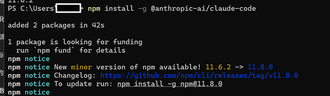](/0xValkyrie_ai/article/2015441632536186977/media/2015344888343310336)

1.4 根据不同的系统 ，Windows/macos/linux ， 在特定的文件夹中新建一个config.json 的文件

```
Windows: C:\Users\ 你的用户名字文件夹 \.claude\
macOS / Linux: ~/.claude/
```

在config.json 中复制下面的内容到文件config.json 中保存退出。

```
{
"primaryApiKey": "any-string-is-ok-here"
}
```

也开始直接在powershell 中输入下面的内容一键创建：

Windows：

powershell

```
$path = "$HOME\.claude"; if (!(Test-Path $path)) { New-Item -ItemType Directory -Path $path -Force }; Set-Content -Path "$path\config.json" -Value '{"primaryApiKey": "any-string-is-ok-here"}'
```

macOS/Linux ：

```
mkdir -p ~/.claude && echo '{"primaryApiKey": "any-string-is-ok-here"}' > ~/.claude/config.json
```

1.5 Windows 在当前用户的文件夹，其他系统应该是在.claude 文件夹中，在文件.claude.json中添加如下配置。

```
{
"hasCompletedOnboarding": true
}
```

Windows 也可以在powershell中一键添加

powershell

```
node --eval "
    const homeDir = os.homedir();
    const filePath = path.join(homeDir, '.claude.json');
    if (fs.existsSync(filePath)) {
        const content = JSON.parse(fs.readFileSync(filePath, 'utf-8'));
        fs.writeFileSync(filePath, JSON.stringify({ ...content, hasCompletedOnboarding: true }, null, 2), 'utf-8');
    } else {
        fs.writeFileSync(filePath, JSON.stringify({ hasCompletedOnboarding: true }), 'utf-8');
    }"
```

[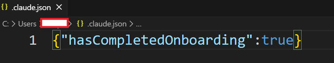](/0xValkyrie_ai/article/2015441632536186977/media/2015351550768717824)

这一步很重要，老版本的Claude 没有这行配置，在启动Claude的时候， 可以加载第三方模型。 现在如果不配置， 就无法加载第三方模型， 启动Claude 时候就会一直让你选择官方的大模型。 这一步就是我说的原来10分钟解决的Claude 安装，我不知道加了这个更新， 还是在我的机器上问了AI 才找到答案。

[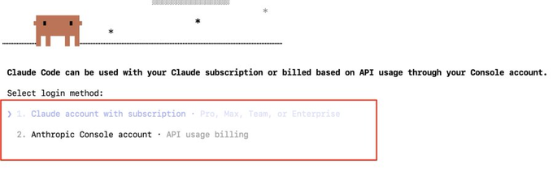](/0xValkyrie_ai/article/2015441632536186977/media/2015358011079000064)

2. 为Claude 配置第三方模型
==================

2.1 安装vscode ， 在官网下载vscode （

<https://code.visualstudio.com/>

）， 安装完成以后，安装一个cluade code YOLO的魔改插件（一定要搜索全称才可以搜到）， 这个魔改插件是刘小排老师推荐的，和官网的区别就是， 插件本身就可以配置第三方模型配置。

启动VS code，点击插件市场， 搜索 cluade code YOLO

[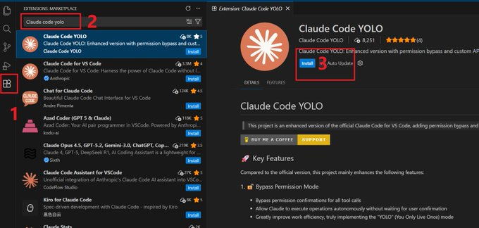](/0xValkyrie_ai/article/2015441632536186977/media/2015366141045043200)

2.2 安装好以后， 右上角就多了一个Claude的图标，点击图标，就可以启动Claude code， 然后开始配置第三方模型API

[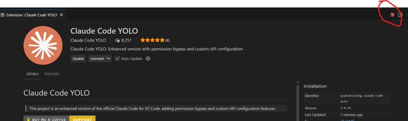](/0xValkyrie_ai/article/2015441632536186977/media/2015368268408901632)

2.3 将任务模式切换为Ask before edits

[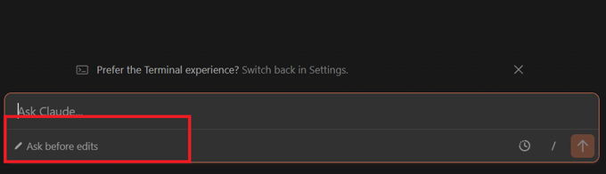](/0xValkyrie_ai/article/2015441632536186977/media/2015372812903751681)

2.3 启动Claude code以后， 在输入框输入/， 找到API configuration， 调出模型配置页面。

[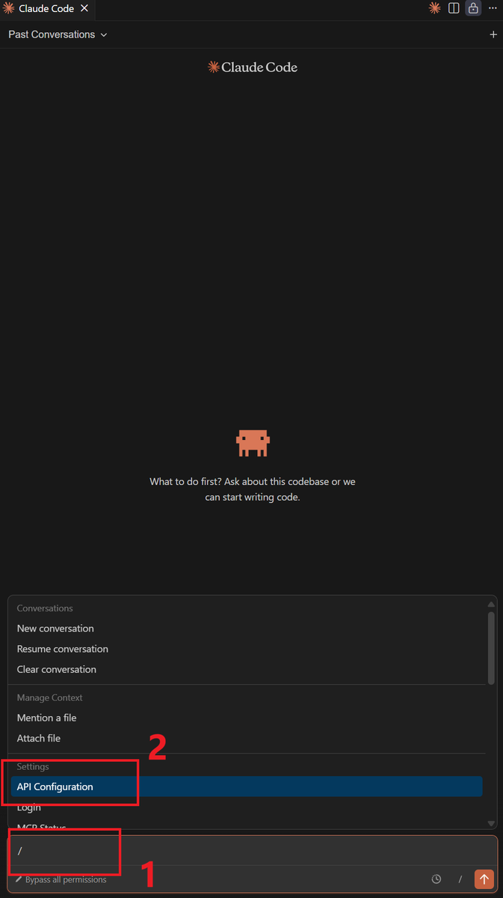](/0xValkyrie_ai/article/2015441632536186977/media/2015372515527532544)

这里以DeepSeek 举例， 注册deep seek(

<https://platform.deepseek.com/api_keys>

)， 然后申请 API key

[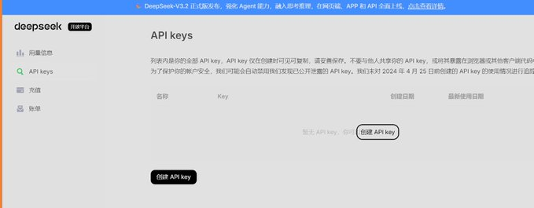](/0xValkyrie_ai/article/2015441632536186977/media/2015424564998840320)

按照下面的参数填写API 配置，token 参数就是申请的API KEY，mode 就是调用的大模型。

"ANTHROPIC\_BASE\_URL": "

<https://api.deepseek.com/anthropic>

",

"ANTHROPIC\_DEFAULT\_HAIKU\_MODEL": "deepseek-chat",

"ANTHROPIC\_DEFAULT\_SONNET\_MODEL": "deepseek-chat",

"ANTHROPIC\_DEFAULT\_OPUS\_MODEL": "deepseek-chat",

"ANTHROPIC\_AUTH\_TOKEN": "sk-xxxx"

[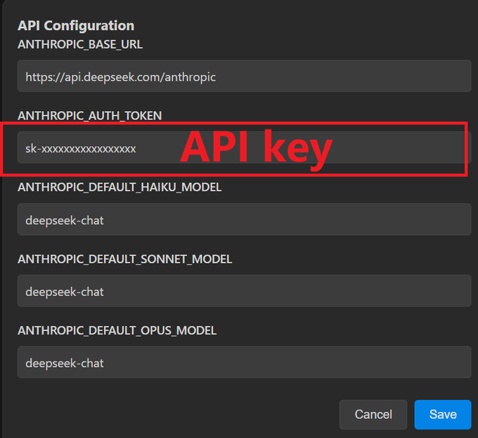](/0xValkyrie_ai/article/2015441632536186977/media/2015429916079030273)

2.4 配置完成后，在输入中随便输点什么， 看看 AI 是否有应答。

[](blob:https://x.com/7f572405-cc81-4903-adb3-7d9b13f2b505)

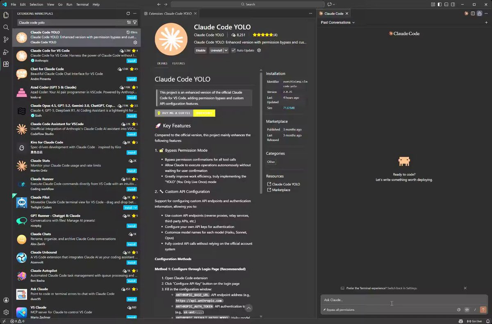

2.5 在powershell 下面， 也可以输入Claude 启动命令行的claude code

[](blob:https://x.com/23113b2e-6fad-46e1-9045-34721ef3460e)

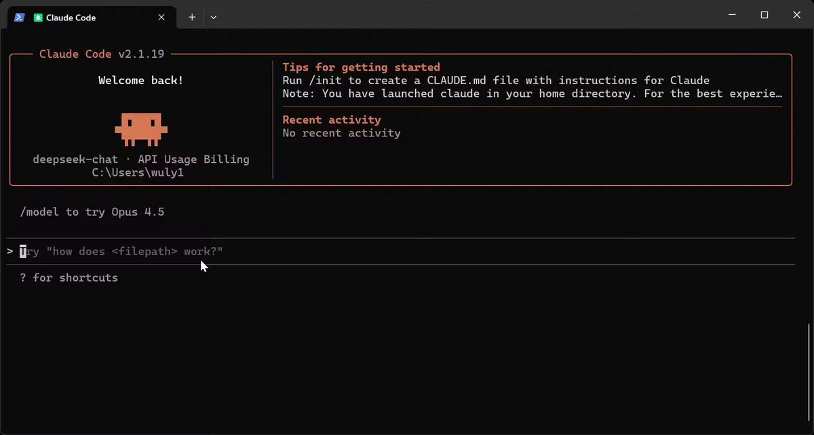

3. 调用中转API 模型
=============

这里用openrouter 的免费模型举例

3.1 现在官网openrouter 注册（

<https://openrouter.ai/models>

）， 然后选择你要用的模型，例如MiMo-V2-Flash

[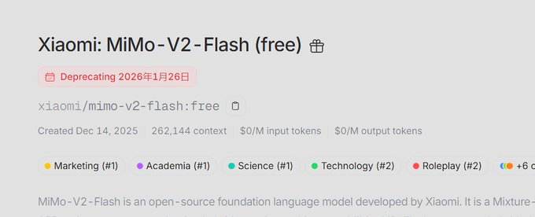](/0xValkyrie_ai/article/2015441632536186977/media/2015437995621457920)

"ANTHROPIC\_BASE\_URL": "

<https://openrouter.ai/api>

",

"ANTHROPIC\_DEFAULT\_HAIKU\_MODEL": "Xiaomi/MiMo-V2-Flash",

"ANTHROPIC\_DEFAULT\_SONNET\_MODEL": "Xiaomi/MiMo-V2-Flash",

"ANTHROPIC\_DEFAULT\_OPUS\_MODEL": "Xiaomi/MiMo-V2-Flash",

"ANTHROPIC\_AUTH\_TOKEN": "sk-or-v1-"

[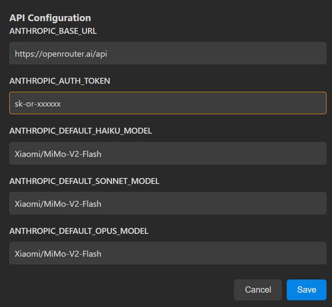](/0xValkyrie_ai/article/2015441632536186977/media/2015437674065408000)

想发布自己的文章？

[升级为 Premium](/i/premium_sign_up)

[下午11:08 · 2026年1月25日](/0xValkyrie_ai/status/2015441632536186977)

·

21.9万

查看

14

99

412

805