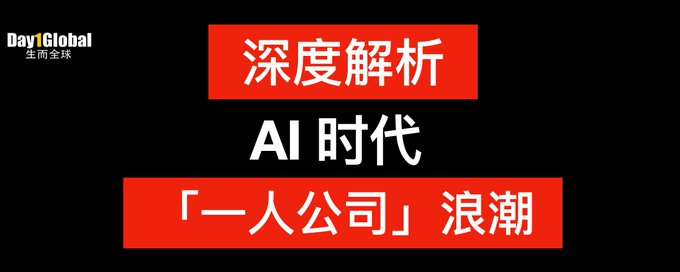
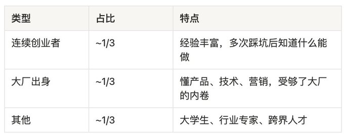
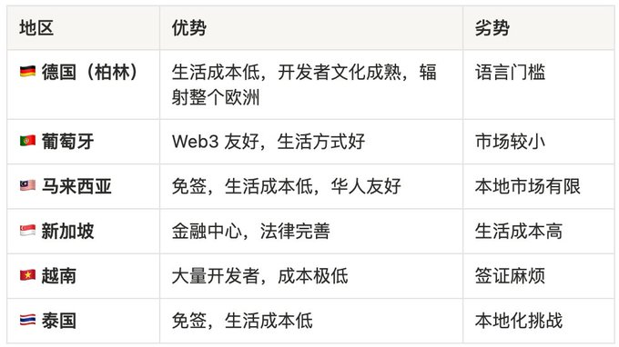
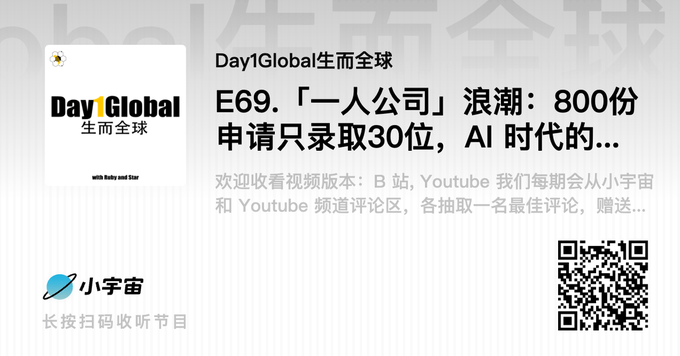

# Source: https://x.com/starzq/status/2015605725050130703?s=20

---

[Star@Day1Global Podcast](/starzq)

[@starzq](/starzq)

订阅

点击 订阅 到 starzq

AI时代的「一人公司」浪潮正在席卷全球

20

63

229

[9.7万](/starzq/status/2015605725050130703/analytics)

未来只会剩三种公司：国企、超级平台、和一人公司

Sam Altman 预测，人类历史上会出现第一个「一人独角兽」——只有一个人，估值超 10 亿美元。Anthropic CEO Dario 甚至认为这很可能在今年就会发生。

这不是硅谷的狂想。在杭州，一个叫「鸿鹄汇」的社区，半年内收到了 800+ 份申请，最终只录取了 30 位——录取率不到 4%，比 YC 还卷。

这期播客我们请到了鸿鹄汇的创始人 Johnny，一位在 VC 领域深耕十余年的老兵。他看到了 AI 正在重塑创业的底层逻辑：一个人 + AI 工具，在某些领域已经有 10 倍以上的生产力加速。

我们聊了聊：为什么一人公司正在成为热门趋势？800 个申请者都在做什么？在中美科技战的夹缝中，还有什么套利机会？以及，未来的公司形态会变成什么样？

> 💡 核心洞察：鸿鹄汇入驻的一人公司里，90% 以上都在做出海产品。出海 + AI + 一人公司，正在成为中国创业者的新范式。

欢迎收听播客完整版：

[小宇宙](https://www.xiaoyuzhoufm.com/episodes/6975cf26109824f9e16abee6)

、

[Apple](https://podcasts.apple.com/cn/podcast/day1global生而全球-web3版/id1707032420)

 、

[Youtube](https://youtu.be/SQh2-3gJsr8)

、

[Spotify](https://open.spotify.com/show/5sJdgNr3sDktS1uysZENW2)

我们每期会从

[小宇宙](https://www.xiaoyuzhoufm.com/episodes/6975cf26109824f9e16abee6)

和 

[Youtube](https://youtu.be/SQh2-3gJsr8)

 频道的评论区，各抽取一名最佳评论，赠送 1 台价值 99 美金的 Onekey Classic 1s 钱包，欢迎大家在评论区积极互动

感谢 

[@consensus\_hk](https://x.com/@consensus_hk)

 香港共识大会对本期播客的支持

8 折购票链接：

<https://go.coindesk.com/consensus-star>

（专属码 STAR20）

Consensus HK 2026 将于 2 月 10 号到 12 号举行，这是 由 

[@CoinDesk](https://x.com/@CoinDesk)

 主办、全球最大 Web3 峰会，超过 15,000 位来自 100 多个国家的行业领袖参会。除了加密技术与金融科技，今年还增加了 AI 与机器人议题。这三天是与从业者深度交流、高效 networking 的好机会

所剩席位不多，大家预购从速

[#ConsensusHK](https://x.com/search?q=%23ConsensusHK&src=hashtag_click)

【目录】
----

1. 为什么是「一人公司」？AI 改变了什么
2. 800 份申请，90% 以上都在做出海
3. 鸿鹄汇的孵化模式：5万美金，不占股
4. 中美科技战下的套利机会
5. 未来的公司，只剩三种形态
6. 给年轻人的建议：这可能比大学更重要
7. 推荐书目：比 AGI 更高的思想

1. 为什么是「一人公司」？AI 改变了什么
----------------------

> 「过去企业的很多功能，它的边际收益在今天的 AI 时代其实是在下降。反而是组织内的协作外包、调用资源的能力，这一部分的效率是在上升的。」—— Johnny

一人公司 vs 超级个体，核心区别是什么？

Johnny 给出了一个非常清晰的定义：系统性的生产能力。

超级个体可能是某个领域的专家、某个平台的大V，但一人公司能够利用 AI 和自动化工具，把个人的 know-how 或 IP 进行大规模的再生产和传播。

以前你要成为「超级个体」，往往需要加入一个组织才能获得工具和平台。但现在：

* HR？ AI 可以帮你处理招聘、合同、社保计算
* 财务？ 自动记账、报税、财务分析
* 开发？ Cursor、Replit、Windsurf 让非程序员也能做产品
* 设计？ Midjourney、Figma AI 让审美变成可执行的工作流
* 营销？ 内容生成、SEO优化、社交媒体管理全部可以半自动化

一个真实的案例：以色列有个一人公司叫 Base44，短时间内做到了 8000万美金 ARR，然后被 Wix 收购。

这在以前是不可想象的。

2. 800 份申请，90% 以上都在做出海
----------------------

鸿鹄汇半年收到 800+ 份申请，最终入驻 30 家，录取率约 3.75%。

Johnny 分享了申请者的画像：

一个惊人的数据：90% 以上都在做出海

这可能是最值得关注的信号——鸿鹄汇入驻的一人公司里，超过 90% 都在做出海产品，或者说是 global 产品，不分国界。

为什么？因为一人公司的优势就是轻、快、灵活，天然适合做全球化生意。你不需要在每个国家建团队，AI + 自动化工具让你一个人就能服务全球用户。

他们都在做什么产品？

📱 ToC 方向：

* AI 语音应用
* AI 音乐生成
* AI 陪伴
* 知识工具
* 个性化儿童绘本（根据孩子的名字、形象、喜好生成专属绘本）

🏢 ToB 方向：

* AI 建筑师事务所：一个小团队开发的工具，让原本需要团队没日没夜做很久的建筑设计，大大加速
* 服务制造业的工业 AI 工具
* 法律、医疗垂直领域的 AI 助手

Johnny 特别提到一个有趣的现象：有个女生，大学刚毕业，完全非技术背景，做的事情就是用 AI 帮别人设计 logo 和产品美学——审美 + AI = 新的生产力。

3. 鸿鹄汇的孵化模式：5万美金，不占股
--------------------

这是我觉得最有意思的部分。

传统 VC 的逻辑：投钱 → 占股 → push 你扩张 → 等退出

鸿鹄汇的逻辑：Grant 模式，5万美金补贴，不占任何股份

为什么这么做？

> 「如果占股份，一方面会筛掉很多优秀的超级个体，因为他们对自己的预期很高。另一方面，一人公司的模式本身就和 VC 的扩张逻辑冲突。」

这笔钱由民营部门出一半，当地政府补贴一半。Johnny 认为，一人公司不需要和大资本绑定，因为它本身就是高杠杆的生意——小投入，大产出。

入驻门槛：

* 5人以下团队
* 背景和做的事情要高度相关
* 能够很大程度利用 AI 工具实现过去做不到的效果
* 不是「表面上是 AI，实际做的和过去差不多」

已经有成果：短短三四个月，已经有 2-3 家企业拿到了外部 TS。

4. 中美科技战下的套利机会
--------------

> 「地缘政治是没办法改变的事实，那我们就只能在夹缝中求生存。但世界很大，不是只有中国和美国。」

Johnny 分享了一个很有意思的案例：有一家公司同时从俄罗斯和乌克兰赚钱。

在这个两极化的世界里，中间地带反而成了机会。

Johnny 看好的地区：

关于出海获客，Johnny 举了个反直觉的例子：

Snipd 是一个欧洲的播客 App，纯英文，没有任何中文内容，但它 1/3 的付费用户来自大中华地区。

它在中国完全没有推广，但通过微博和小红书上的 KOL 自发安利，成了学英语神器。

> 「如果你的产品做得好，你不缺付费用户。你得有审美，得打动大家。」

5. 未来的公司，只剩三种形态
---------------

这是 Johnny 最有洞察的一个预测：

> 「3-5年后，随着 AI 普及，这世界上的公司可能只有三种类型。」

1️⃣ 国有企业保障民生，提供基础服务。

2️⃣ 超级平台 / 大厂美国的 Mag 7，中国的 BAT、字节、快手，以及新的大模型公司。

3️⃣ 一人公司 / 小团队灵活、高效、专注于细分领域。

那中型公司呢？

> 「中型公司的未来只有两条路：要么被收购，要么分解成若干个一人公司。」

这个判断让我想到 a]6z 的 Benedict Evans 说的：软件吃掉世界之后，AI 正在吃掉软件。当 AI 能替代大部分中层管理和执行工作时，你要么足够大（有平台效应），要么足够小（灵活敏捷）。

对于一人公司创业者，Johnny 认为终局有两种：

* Keep 小做：很多人会选择这条路，因为轻便、灵活、自由，甚至可以「躺着赚钱」
* 做大：1000 个人里可能有 1-2 个有野心去挑战超级平台

6. 给年轻人的建议：这可能比大学更重要
--------------------

> 「如果现在我回到二十几岁，我非常鼓励年轻人去做一人公司。甚至我觉得这会是比大学教育更重要的一步。」

Johnny 分享了一个真实发生的故事：

有个年轻人在美国刚读完大学，听说了鸿鹄汇，直接买机票飞杭州，落地就来入驻了。

为什么现在是最好的时机？

1. AI 工具成本极低：各大平台还在打仗，补贴阶段
2. 实践比学历更重要：未来用工单位可能会看「你有没有做过一人公司？做出了什么成果？」
3. 试错成本低：一个人 + AI，几乎零边际成本可以验证 idea

需要避坑的方向：

* Vite coding（竞争已经白热化）
* 招聘、法律等已经有巨头跑出来的领域
* 如果要做，必须做细分、做差异化

7. 推荐书目：比 AGI 更高的思想
-------------------

Johnny 最后推荐了一本 1999 年的书：

📚 《Posthuman》（后人类）—— Katherine Hayles

这本书在互联网还没普及的时代，就预言了人机合一的未来。

核心观点：

> 「AGI 追求的是机器超过人类。但比这更高的境界是：人类如何与比自己某方面能力强的智能体合作，共同解决问题。人类永远不是甩手掌柜。」

用 

[@Rubywang](https://x.com/@Rubywang)

 的话总结：人 + 机器人 + AI > AI 本身。

这也是一人公司的哲学：不是被 AI 替代，而是与 AI 共生。

写在最后
----

今天我们还在讨论「一人公司」，觉得这是个新鲜事物。

但 Johnny 认为，未来这会变得稀松平常——就像鸿鹄汇现在 90% 以上的入驻项目都在做出海一样，出海 + 一人公司，正在成为中国创业者的默认选项。

如果你对鸿鹄汇感兴趣：

* 官网：

  <https://honghub.com/>
* 公众号：鸿鹄汇
* 申请：滚动录取，没有 batch 概念

声明：本文所有讨论都只提供信息，不是投资建议，DYOR。

想发布自己的文章？

[升级为 Premium](/i/premium_sign_up)

[上午10:00 · 2026年1月26日](/starzq/status/2015605725050130703)

·

9.7万

查看

20

63

229

351

---

Day1Global Podcast

@day1globalpod

·

[1月26日](/day1globalpod/status/2015595230012289369)

回复

[@day1globalpod](/day1globalpod)

小宇宙：[https://xiaoyuzhoufm.com/episodes/6975cf26109824f9e16abee6…](https://t.co/AIpmh4rL3C)
Youtube: [https://youtu.be/SQh2-3gJsr8](https://t.co/ulUIpJoqDh)
我们每期会从小宇宙和 Youtube 频道的评论区，各抽取一名最佳评论，赠送 1 台价值 99 美金的 Onekey Classic 1s 钱包，欢迎大家在评论区积极互动
感谢 

[@OneKeyCN](/OneKeyCN)

 对 

[@day1globalpod](/day1globalpod)

 的支持

2

1

9

[941](/day1globalpod/status/2015595230012289369/analytics)

---

Day1Global Podcast

@day1globalpod

·

[1月26日](/day1globalpod/status/2015595226124140786)

E69.「一人公司」浪潮：800份申请只录取30位，AI时代的新创业逻辑 ft. 鸿鹄汇 Johnny
未来只会剩三种公司：国企、超级平台、和一人公司
从美元VC到一人公司孵化器，我们这期和Johnny聊了聊
为什么AI使得一人公司成为热门趋势
中美科技战下的套利机会
未来的公司形态
时间轴
[00:00](/day1globalpod/status/2015595226124140786?t=0) - Sam

显示更多

0:01 / 58:02

4

2

14

[1,301](/day1globalpod/status/2015595226124140786/analytics)