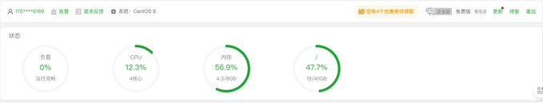
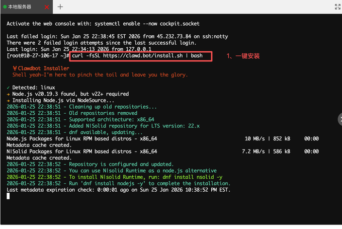
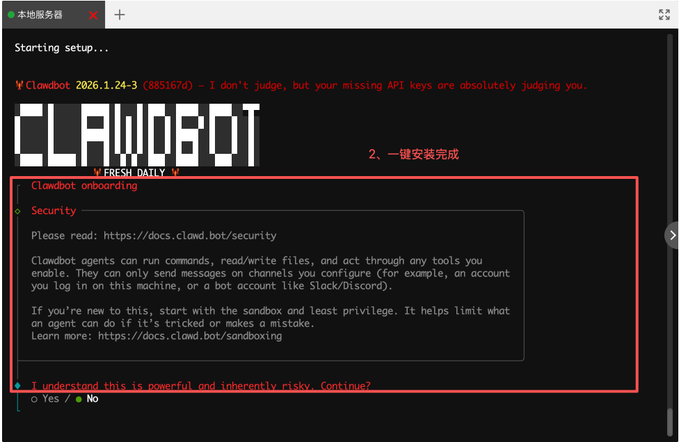
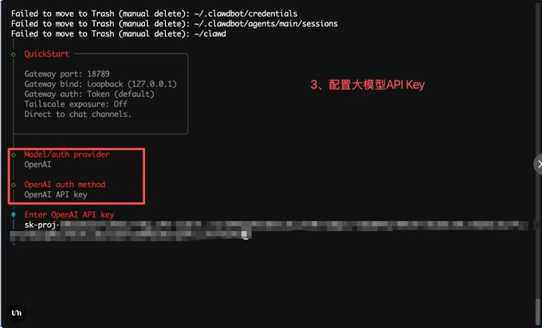
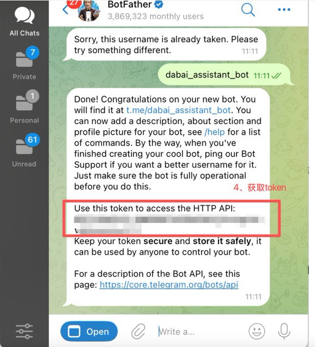
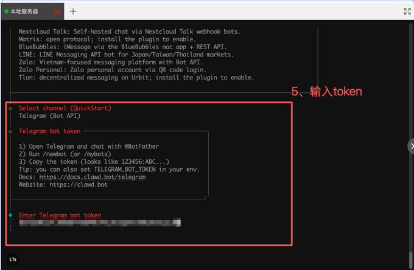
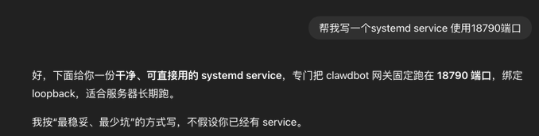
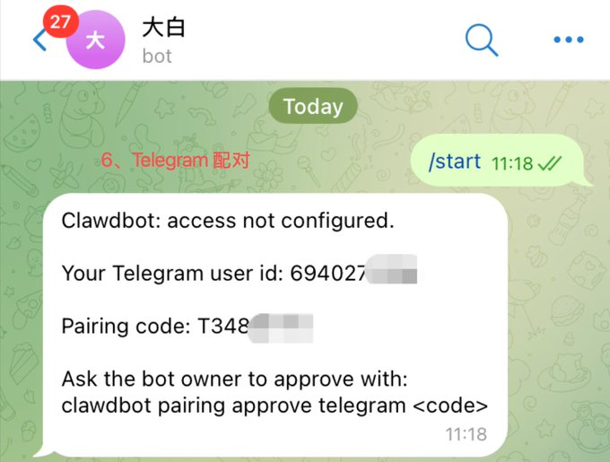
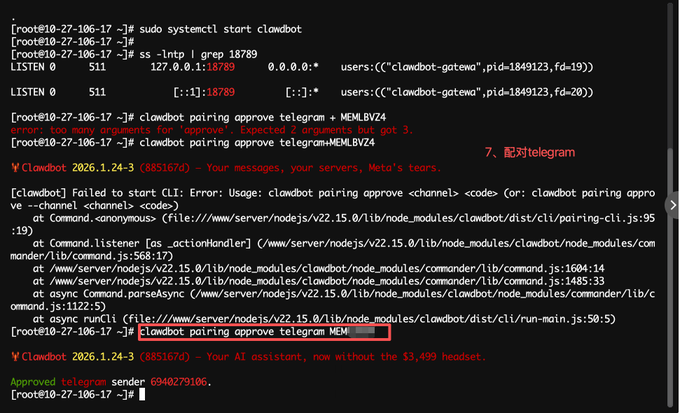
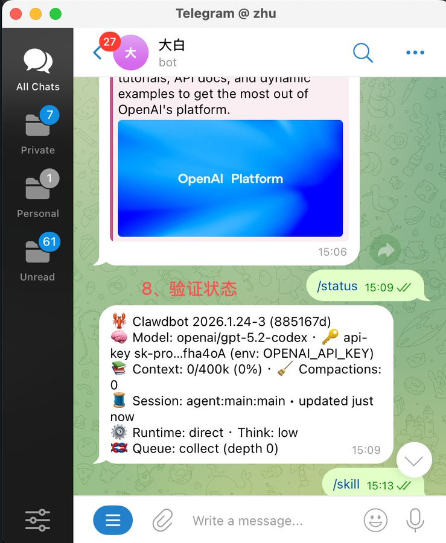

# Source: https://x.com/GoSailGlobal/status/2015710240042590416?s=20

---

[Jason Zhu](/GoSailGlobal)

[@GoSailGlobal](/GoSailGlobal)

ClawdBot 详细安装使用指南

8

80

350

[6.4万](/GoSailGlobal/status/2015710240042590416/analytics)

什么是 ClawdBot
------------

2026年1月，一款名为 ClawdBot 的开源AI助手在技术社区引发了广泛关注。与我们熟悉的 ChatGPT、Claude 等聊天机器人不同，ClawdBot 代表了一个全新的范式：从被动的"对话式AI"进化为主动的"智能代理"（Agentic AI）。

ClawdBot 最大的特点是它不仅能回答你的问题，还能主动联系你。想象一下：早上醒来，你的 WhatsApp 上收到一条消息："今天有3个重要会议，已帮你整理好议程；昨晚收到15封邮件,其中2封需要紧急回复。" 这就是 ClawdBot 的工作方式。

更重要的是，ClawdBot 是本地优先（Local-First）的。它运行在你自己的硬件上，可以是一台 Mac Mini、闲置的笔记本电脑，或者云服务器，所有数据都在你的掌控之中，不会上传到任何第三方平台。对于重视隐私的用户来说，这是一个巨大的优势。

准备工作
----

在开始安装之前，请确保你具备以下条件：

系统要求

硬件选择（任选其一）：

* Mac Mini 或 MacBook（推荐，体验最佳）
* Linux 服务器（Ubuntu/Debian 系）
* Windows PC（需要安装 WSL2）
* 云服务器（Hetzner、AWS、DigitalOcean 等）

软件要求：

* Node.js 22 或更高版本（必须）
* 基本的命令行使用经验

博主系统：

AI 服务提供商

你需要准备以下任意一个：

* Anthropic (Claude)（强烈推荐）
  Claude Pro 账号（支持 OAuth 授权）
  或 Anthropic API Key
* OpenAI (ChatGPT)
  ChatGPT Plus 账号
  或 OpenAI API Key

> 💡 为什么推荐 Claude？ Claude 具有更长的上下文窗口，适合处理复杂的多步骤任务。而且 Anthropic 对数据隐私的承诺更严格。

消息平台账号

至少需要一个消息平台（初次配置推荐 Telegram）：

* Telegram：需要通过 

  [@BotFather](https://x.com/@BotFather)

   创建一个 Bot Token
* WhatsApp：需要手机扫码登录
* Discord：需要在 Discord Developer Portal 创建一个 Bot

预估时间

根据 AI 领域知名博主 Damian Player 的教程，完整安装和配置大约需要 30 分钟（已具备上述条件的情况下）。

安装指引
----

小编系统：Centos 内存8

步骤 1：一键安装指令

这是最简单、最快速的安装方式。打开你的终端，运行以下命令：

curl -fsSL 

<https://clawd.bot/install.sh>

 | bash

这个脚本会自动：

* 检测你的操作系统
* 确认 Node.js 22+ 是否安装（如果没有会自动安装）
* 全局安装 ClawdBot CLI 工具

步骤 2：出现Clawdbot onboarding即安装完成

步骤 3：配置 AI 提供商

向导会首先问你想使用哪个 AI 服务：

选择 Anthropic (Claude)（推荐）：

* 如果你有 Claude Pro 账号，选择 OAuth 授权（最简单）
* 如果你有 API Key，直接粘贴即可

选择 OpenAI：

* 提供你的 OpenAI API Key

连接消息平台
------

ClawdBot 本身没有聊天界面，它通过你常用的消息应用与你交互。下面介绍三种主流平台的连接方法。

方法一：Telegram（最推荐）

Telegram 是最容易配置的选项，适合新手使用。

步骤 4：配置Telegram（配置案例）

1. 在 Telegram 中搜索并打开 

   [@BotFather](https://x.com/@BotFather)

   （这是 Telegram 官方的机器人管理工具）
2. 发送命令 /newbot 创建一个新机器人
3. 按照提示给机器人起名字：
   Display Name：显示名称（例如："My AI Assistant"）
   Username：用户名，必须以 bot 结尾（例如："my\_ai\_assistant\_bot"）
4. [@BotFather](https://x.com/@BotFather)

    会返回一个 Bot Token，形如：

110201543:AAHdqTcvCH1vGWJxfSeofSAs0K5PALDsaw

1. 保存好这个 Token！
2. 回到终端，在 clawdbot onboard 向导中粘贴这个 Token
3. 完成后，在 Telegram 中搜索你刚创建的机器人用户名，发送一条消息激活它
4. 运行以下命令锁定你的账号（仅允许你使用）：

clawdbot health

步骤 5：Clawdbot连接Telegram

安装和使用技能（Skills，可先跳过）
--------------------

ClawdBot 的真正威力来自它的 "Skills" 系统——这些是可插拔的功能模块，让 ClawdBot 能够访问你的各种工具和服务。

浏览可用技能

访问 

[ClawdHub.com](https://clawdhub.com/skills)

 可以查看所有官方和社区提供的技能。常见的包括：

* google-calendar：管理你的 Google 日历
* gmail：读取和回复邮件
* linear：管理项目任务
* slack：发送和接收消息
* github：查看 issue、PR 和代码
* web-browser：浏览网页获取信息

安装技能

使用以下命令安装技能：

clawdbot skills install google-calendar
clawdbot skills install gmail
clawdbot skills install linear

安装过程中，ClawdBot 会引导你完成 OAuth 授权，让 Bot 可以访问相应服务。

查看已安装的技能

clawdbot skills list

实际应用场景

安装技能后，你可以对 ClawdBot 说：

* "帮我检查今天有哪些会议"
* "总结一下昨天收到的重要邮件"
* "把这个任务添加到 Linear"
* "搜索一下最近关于 AI Agent 的资讯"

它会自动调用相应的 Skills 来完成任务。

编写自定义技能

如果你熟悉 TypeScript，可以编写自己的 Skill。官方文档提供了详细的 API 指南：

clawdbot skills create my-custom-skill

这会生成一个模板项目，你可以在此基础上开发。

配对
--

检测服务是否在运行

命令行输入，按你的端口查看，默认18789

ss -lntp | grep 18789

有输出结果就表示启动成功了。

注意，这里如果没有任何输出就是启动失败，未运行成功，可能就需要写一个systemd service来启动，可以让大模型帮你写一个（提示词为：帮我写一个systemd service 使用18790端口）

步骤 6：Telegram配对，获取配对

打开Telegram，和刚刚创建的机器人对话 /start, 这个时候会出现一个配对码

clawdbot pairing approve telegram ZEGWXXXX

步骤 7：Telegram配对

终端输入clawdbot pairing approve telegram + 你的配对码：

clawdbot pairing approve telegram ZEGWXXXX

步骤 8：telegram机器人键入/stats查看状态

安全建议
----

由于 ClawdBot 拥有高级权限（可以执行命令、读取文件、访问邮件等），必须认真对待安全配置。

1. 限制访问权限

编辑配置文件 ~/.clawdbot/clawdbot.json，添加 allowFrom 字段：

{
"allowFrom": ["+8613800138000"], // 你的手机号（WhatsApp）
// 或者
"allowFrom": ["123456789"] // 你的 Telegram User ID
}

这样只有你能使用这个 Bot，陌生人无法触发它。

1. 不要分享 API Key 和 Bot 信息

* 绝对不要将你的 Claude/OpenAI API Key 分享给任何人
* 绝对不要公开你的 Telegram Bot Token
* 不要把你的 Bot 用户名告诉不信任的人

1. VPS 部署安全

如果你在云服务器上运行 ClawdBot：

配置防火墙：

# 只允许本地访问 Gateway 端口
sudo ufw deny 18789
sudo ufw allow from 127.0.0.1 to any port 18789

使用 SSH 隧道：

如果需要远程访问控制面板，使用 SSH 隧道而不是直接暴露端口：

ssh -L 18789:localhost:18789 user@your-vps-ip

然后在本地浏览器访问 http://127.0.0.1:18789。

1. 从小权限开始

不要一开始就给 ClawdBot 完整系统访问权限：

* 先安装 1-2 个低风险的 Skills（如 web-browser）
* 观察它的行为，查看日志
* 逐步扩大权限（邮件、日历等）

1. 定期检查日志

在控制面板（http://127.0.0.1:18789）中可以查看 ClawdBot 的所有操作记录，定期审查确保没有异常行为。

Clawdbot帮助文档：

<https://docs.clawd.bot/>

想发布自己的文章？

[升级为 Premium](/i/premium_sign_up)

[下午4:55 · 2026年1月26日](/GoSailGlobal/status/2015710240042590416)

·

6.4万

查看

8

80

350

498