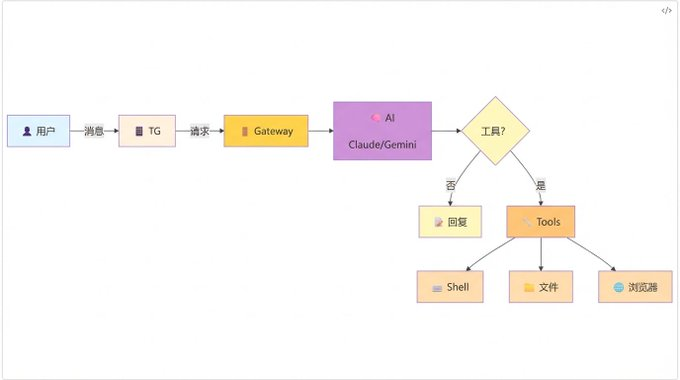

# Source: https://x.com/KatherineQ1212/status/2016043617098363114?s=20

---

[Silkblossom](/KatherineQ1212)

[@KatherineQ1212](/KatherineQ1212)

Clawdbot 安全指南：如何让 AI 机器人不打穿你的防线

1

1

[5](/KatherineQ1212/status/2016043617098363114/analytics)

这周帮 朋友配置了 Clawdbot，发现大家都在安全上踩坑。

有个朋友直接把网关端口开到公网，没设任何认证；另一个朋友在主力开发机上装了，然后机器人把他的项目文件夹删了一半。

更可怕的是，fmdz 的公网扫描发现：120+ 个 Clawdbot 实例完全零认证暴露在互联网上。

我看到这些问题就在想，大家对 AI Agent 的安全边界真的没有概念。

Benson（

[@BensonTWN](https://x.com/@BensonTWN)

）预测：Clawdbot 在未來一個月內會出現大量安全事故，Prompt Injection 會是主因。

这篇文章，我想从技术角度，系统化地讲讲 Clawdbot 的安全配置，避免你成为下一个安全事故的受害者。

Clawdbot 的网关架构
--------------

先搞清楚 Clawdbot 的核心设计。

它和普通聊天机器人最大的不同，在于网关（Gateway）架构。网关是 Clawdbot 的核心组件，负责接收外部消息（Telegram、WhatsApp 等）、调用 AI 模型、执行工具命令。

简单说，网关就是你的电脑和聊天应用之间的桥梁。但这个桥梁很特殊，它不仅能传递消息，还能执行命令。

这个架构图展示了：

* 用户通过 Telegram 发送指令
* Gateway 接收消息并调用 AI 模型
* AI 模型 理解意图，决定是否需要工具
* 如果需要工具，调用 Tools 层（Shell、文件、浏览器）
* 工具执行结果返回给 AI，生成回复
* 通过 Gateway 返回给用户

这个架构带来三个核心安全问题：

1. 网络暴露风险：网关需要对外开放端口（如果远程访问）
2. 认证机制薄弱：如果只用简单的 token，容易被爆破
3. 权限控制复杂：工具层能执行什么操作，需要精细配置

很多教程只教你"装上就能用"，完全不讲这三点。这是很危险的。

三层防护体系
------

基于 Clawdbot 的架构，我建议建立三层防护：

第一层：网络层防护

这一层的目标是：只有你能连上网关，别人连不上。

配置方法：

* 本地部署：默认 localhost:8080，只在本地可访问
* 远程访问：用 Tailscale 建立虚拟局域网，或者 SSH 隧道转发
* 如果必须公网暴露：配置防火墙白名单（只允许你的 IP），加上强认证

我强烈推荐 Tailscale。它是个零配置的内网穿透工具，相当于给你的机器人装了个专属 VPN。你在外面的电脑上装个客户端，就能像在本地一样访问家里的机器人。

而且 Tailscale 有个好处：它是点对点加密的，中间没有中继服务器，安全性很高。

第二层：认证层防护

这一层的目标是：即使有人连上网关，也要证明他是你。

Clawdbot 支持多种认证方式：

* 配对模式（Pairing）：最推荐。你需要先在本地和机器人"握手"，双方交换密钥，之后只有配对成功的设备能控制它
* Token 模式：次推荐。设置一个长随机字符串作为 token，每次请求都要带上。但 token 可能被泄露，需要定期更换
* 公开模式（Open）：千万别用。任何人都能控制你的机器人

配置建议：

* 私聊（DM）：用配对模式，默认白名单
* 群聊：必须 @ 机器人才响应，且限制在哪些群里可以用

第三层：工具权限层

这一层的目标是：即使有人通过认证，也只能做有限的操作。

Clawdbot 的工具系统很强大，但也很危险：

* shell 工具：能执行任何 Shell 命令
* browser 工具：能控制浏览器操作网页
* write 工具：能写入任何文件
* read 工具：能读取任何文件

你需要按"最小权限原则"来配置：

* 沙箱模式：把工具限制在特定目录，比如 ~/clawdbot-sandbox
* 工具分级：不同 agent 不同权限。比如"代码助手"只能访问 ~/code，"系统管理员"才能执行系统命令
* 禁用高风险工具：如果不需要浏览器控制，直接禁用

Kevin Ma 的 9 条实践逐条拆解
--------------------

Kevin Ma（

[@kevinma\_dev\_zh](https://x.com/@kevinma_dev_zh)

）总结的 9 条安全实践，我认为是当前最全面的指南。我逐条解释并补充具体配置：

1. 先审计

定期跑 clawdbot security audit，改配置或暴露端口后务必再跑一次。

这个命令会检查：

* 网关端口是否暴露在公网
* 认证机制是否启用
* 危险工具是否开启
* 日志和配置文件权限是否正确

建议：每次改完配置，都跑一次审计。看到红色警告就马上改。

2. 网关不裸露

默认只在本机可访问；远程访问优先用 Tailscale/SSH。任何对外暴露都必须有强鉴权与防火墙白名单。

⚠️ 特别警示：云端部署的风险

最近很多教程为了降低成本，教大家把 Clawdbot 部署到云服务器（AWS、阿里云等），然后开放端口。这个做法非常危险。

羊博士（

[@ybspro\_official](https://x.com/@ybspro_official)

）指出，云端部署会直接把私有化的工具暴露在公网上，任意测绘引擎都可以发现：

* 不只是 Shodan：还有 ZoomEye、Censys、Fofa 等很多网络测绘服务
* 被动扫描：即使你主动隐藏，这些引擎也会主动扫描全网端口
* Token 窃取：黑客可以通过各种方式窃取你的 bot token
* 白名单篡改：更危险的是，黑客能编辑白名单把自己加进去，永久控制你的机器人

我的建议：除非你完全理解风险并有企业级安全防护能力，否则不要把 Clawdbot 部署到云端。买台 Mac mini 或便宜的 NUC，物理隔离才是最安全的。

⚠️ 如果你必须在 VPS 上部署：

有些情况下，你可能确实需要在 VPS 上部署 Clawdbot（比如需要 24x7 在线但没有物理设备，需要全球分布式访问等）。

如果是这样，请务必阅读我的另一篇文章：

* Clawdbot VPS部署安全增强指南

这篇文章详细介绍了：

* 7 层防护体系：网络层、认证层、应用层、系统层、监控层、应急层、维护层
* 完整的安全检查清单：部署前、配置、运行时、应急准备
* 实战配置示例：Tailscale VPN、SSH 隧道、反向代理、沙箱隔离
* 应急响应预案：一键锁定脚本、快速恢复流程
* 监控告警脚本：实时检测异常

即使你完全按照指南配置，VPS 部署的风险仍然远高于本地部署。请慎重选择。

Tailscale 配置示例：

> # 1. 在 Clawdbot 服务器上安装 Tailscale
> curl -fsSL 
>
> <https://tailscale.com/install.sh>
>
>  | sh
> tailscale up
> # 2. 在你的笔记本上也装 Tailscale
> # 3. 获取服务器的 Tailscale IP（比如 100.x.x.x）
> # 4. 在 Telegram 上配置这个 IP 作为网关地址

SSH 隧道配置示例：

> # 在本地建立隧道
> ssh -L 8080:localhost:8080 user@your-server
> # 然后你的本地 8080 端口就映射到了服务器的 8080
> # Telegram 配置 http://localhost:8080

3. DM 默认配对/白名单

陌生人不要直接触发机器人；能用配对（pairing）就别用公开（open）。

配对流程：

1. 在 Clawdbot 配置文件启用 require\_pairing: true
2. 第一次连接时，机器人会返回一个配对码
3. 你在本地验证这个配对码
4. 之后你的 Telegram ID 就在白名单里了

4. 群聊默认必须@

尽量只在被点名时回应，并限制允许使用的群/频道范围。

配置示例：

> telegram:
> require\_mention: true # 必须才响应
> allowed\_chats:
> - "我的测试群: -1001234567890"
> - "我的工作群: -1009876543210"

5. 工具限权 + 沙箱

把执行/写入/浏览器等高风险能力关进 sandbox 或直接禁用，按"最小权限"给不同 agent 分级。

沙箱配置示例：

> tools:
> shell:
> enabled: true
> sandbox\_path: ~/clawdbot-sandbox # 限制在这个目录
> allow\_commands: # 只允许这些命令
> - git
> - npm
> - node
> - ls
> - cat

工具分级示例：

> agents:
> code-assistant:
> tools: [read, write, shell]
> permissions:
> read: ["~/code"]
> write: ["~/code/temp"]
> shell: "~/code"
> system-admin:
> tools: [shell, browser]
> permissions:
> shell: "/"
> require\_auth: "2fa" # 需要二次确认

6. 浏览器控制视为管理员权限

只在可信环境启用；端点必须 token + 仅内网/尾网访问；尽量用专用浏览器 profile。

浏览器控制是最危险的，因为它能：

* 登录你的所有网站账户
* 执行转账操作
* 读取你的隐私数据

建议：

* 如果不需要，直接禁用 browser 工具
* 如果必须用，创建一个专门的浏览器 profile（比如 clawdbot-profile）
* 这个 profile 里不要登录任何敏感账户（邮箱、银行等）

7. 插件只装可信来源

插件等同在网关上运行代码：固定版本、少装、只启用明确允许的插件。

插件安全检查清单：

* 来源：插件来自官方仓库还是 GitHub 上的个人项目？
* 星标数：有没有足够的社区使用和审查？
* 代码审计：有没有看过源码？
* 权限：插件请求什么权限？为什么需要这些权限？

建议：只装必要的插件，装之前先看代码。

8. 保护本地数据与日志

~/.clawdbot（配置、凭据、会话转录）按"钥匙串"对待：严格权限、磁盘加密；日志保持脱敏，分享排障信息要先做删减。

文件权限设置：

> # 只有你能读写这些文件
> chmod 700 ~/.clawdbot
> chmod 600 ~/.clawdbot/\*.yaml
> chmod 600 ~/.clawdbot/credentials.json

如果可能，给整个 home 目录加密：

> # macOS 用 FileVault
> # Linux 用 LUKS 或 ecryptfs

日志脱敏示例：

> logging:
> sanitize:
> - remove: ["api\_token", "password", "secret"]
> replace:
> pattern: "email\\s\*:\\s\*([^\\s]+)"
> replacement: "email: \*\*\*@\*\*\*.com"

9. 出事流程

先停/收紧访问 → 换所有相关 token/key → 查日志/转录/插件 → 再跑审计确认干净。

应急预案脚本：

> #!/bin/bash
> # 
>
> [emergency-lockdown.sh](//emergency-lockdown.sh)
>
> echo "1. 停止 Clawdbot 服务..."
> systemctl stop clawdbot
> echo "2. 收紧网络访问..."
> ufw deny 8080
> echo "3. 备份日志..."
> cp -r ~/.clawdbot/logs ~/clawdbot-logs-backup-$(date +%s)
> echo "4. 撤销 API Token..."
> # 这里需要你去 Anthropic 控制台手动撤销
> echo "5. 检查可疑插件..."
> ls -la ~/.clawdbot/plugins/
> echo "6. 运行安全审计..."
> clawdbot security audit
> echo "7. 检查系统进程..."
> ps aux | grep -i claw
> echo "完成。请手动检查日志和插件。"

自检工具：让 AI 帮你检查配置
----------------

除了手动运行 clawdbot security audit，你还可以用 AI 自己来检查自己的配置。

智弦（

[@zhixianio](https://x.com/@zhixianio)

）写了一个 ClawdBot 自检指南，并附上了一个可以让它自己跑的自检 skill。这个自检工具会：

自动检查项：

* 网关端口是否暴露在公网
* 认证机制是否正确配置
* 危险工具是否启用
* 日志和配置文件权限是否正确
* 是否有可疑的第三方插件
* API Token 是否安全存储

使用方法：

1. 在 Clawdbot 的 Skills 目录添加自检 skill
2. 直接在 Telegram 说："运行安全自检"
3. AI 会自动检查所有配置项
4. 生成详细的安全报告并给出修复建议

智弦的完整自检指南：

<https://x.com/zhixianio/status/2015661002273280099>

这个工具的好处是：让最了解 Clawdbot 的 AI 来帮你检查安全配置，比人工检查更全面、更及时。

建议每次改完配置、添加新插件、或者暴露端口后，都运行一次自检。

AI 错误率与人工审核
-----------

除了配置，还有个更深层的问题：AI 会犯错。

日月小楚（

[@riyuexiaochu](https://x.com/@riyuexiaochu)

）提到一个关键数据：即使采用复杂的 prompt 工程进行约束，AI 仍然有 1-5% 的错误率。

这意味着什么？如果让 AI 操作你的钱包、个人数据、重要账号，每 100 次操作就有 1 次可能出错。

我的建议是：

高风险操作必须人工审核

* 删除文件：AI 生成命令，你确认后才执行
* 转账支付：AI 填好表单，你手动点确认
* 部署上线：AI 生成脚本，你 review 后才运行

中风险操作设置回滚机制

* Git 操作：每次提交前自动打个 tag，方便回滚
* 文件修改：自动备份原文件
* 配置更改：记录变更历史

低风险操作可以让 AI 自动执行

* 读取文件内容
* 搜索代码
* 运行测试（在隔离环境）

沙箱和隔离的最佳实践
----------

最后，我想强调沙箱的重要性。

即使你做了所有防护，AI 还是可能因为误操作搞破坏。最好的办法是给它一个独立的"沙盒环境"。

硬件隔离（推荐）

花几百美金买个 Mac mini 或便宜的 NUC，专门跑 Clawdbot。这个好处是：

* 物理隔离：AI 搞坏了也不影响你的主力机
* 24x7 运行：不用担心关机
* 资源可控：给它分配固定的 CPU、内存

💡 详细的 Mac mini 安装指南：

如果你决定使用 Mac mini，我写了完整的安装教程：

* Mac mini安装Clawdbot完整指南-从开箱到7x24运行

内容包括：

* 硬件选购（M1/M2 Pro/M4 配置对比）
* 系统初始化（10 步完整流程）
* 安全配置（沙箱、配对模式）
* 远程访问（SSH/Tailscale/VNC）
* 7x24 运行配置（防休眠、自动启动、监控告警）

从开箱到 24x7 运行，手把手教你完成配置。

虚拟机隔离

如果不想买新设备，用虚拟机也可以：

* VMware、VirtualBox、Parallels 都行
* 给虚拟机分配独立的虚拟硬盘
* 设置快照，出事了就回滚

容器隔离（轻量级）

如果你用的是 Linux，可以用 Docker 容器：

> FROM ubuntu:22.04
> RUN apt-get update && apt-get install -y python3 nodejs npm
> WORKDIR /workspace
> # Clawdbot 容器只能访问这个目录

容器的好处是启动快、资源占用小，但隔离性不如虚拟机。

总结
--

Clawdbot 是个强大的 AI Agent 框架，但它的强大也意味着风险。你给它的权限越多，它能做的事情越多，但出事后的损失也越大。

安全配置的核心原则是：

* 最小权限：只给必要的权限，不贪多
* 纵深防御：网络层、认证层、权限层三层防护
* 隔离运行：给 AI 准备独立的沙盒环境
* 人工审核：高风险操作必须你亲自确认

记住，AI 机器人是你的助手，不是你的主人。安全做到位，它才能真正解放你的生产力。

否则，它可能成为打穿你防线的那个"内鬼"。

相关阅读
----

3. 其他相关文章

* 那个在公网裸奔的Clawdbot，正在泄露你的所有秘密 - 风险警示

  <https://x.com/KatherineQ1212/status/2015943899660124301>
* Clawdbot最佳安装指南-4种方案全对比 - 方案选择

  <https://x.com/KatherineQ1212/status/2015928775838740501>

Sources:

* [fmdz 的公网扫描结果（120+实例暴露）](https://x.com/fmdz/status/20155514)
* [Benson 的安全预警与场景分类](https://x.com/BensonTWN/status/2015758584110563478)
* [羊博士的云端部署风险警示](https://x.com/ybspro_official/status/2015709813276303619)
* [智弦的 CladwBot 自检指南](https://x.com/zhixianio/status/2015661002273280099)
* [从0到1玩转Clawdbot](https://www.53ai.com/news/LargeModel/2026012692386.html)
* [Clawdbot 的真正创新是网关](https://www.53ai.com/news/OpenAI/2026012636218.html)
* [The State of AI Agent Security 2026](https://neuraltrust.ai/guides/the-state-of-ai-agent-security-2026)

想发布自己的文章？

[升级为 Premium](/i/premium_sign_up)

[下午3:00 · 2026年1月27日](/KatherineQ1212/status/2016043617098363114)

·

5

查看

1

1