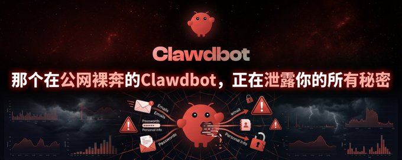

# Source: https://x.com/KatherineQ1212/status/2015943899660124301?s=20

---

[Silkblossom](/KatherineQ1212)

[@KatherineQ1212](/KatherineQ1212)

那个在公网裸奔的Clawdbot，正在泄露你的所有秘密

2

3

3

[728](/KatherineQ1212/status/2015943899660124301/analytics)

说起来，前两天我在刷推的时候，看到一条让我后背发凉的推文。

一个叫 fmdz 的开发者分享了一个扫描结果：他在公网上扫描了部署 Clawdbot 的实例，发现有 100 多个机器人完全零认证暴露在互联网上。

这意味着什么？意味着任何人都可以通过 Telegram 给这些机器人发消息，然后远程执行命令、读取文件、甚至打开浏览器操作你的银行账户。

我当时就在想，这事儿不对啊。

一条推文揭露的安全灾难
-----------

先给不了解背景的朋友补个课。Clawdbot 是最近火到爆的开源 AI 智能体项目，它可以本地运行，通过 Telegram、WhatsApp 等聊天应用远程控制你的电脑。核心能力包括：执行 Shell 命令、读写文件、控制浏览器、运行脚本等等。

简单说，就是你可以在 Telegram 上跟它说"帮我把项目仓库拉下来、跑测试、修复 bug、提交代码"，它就会在你的电脑上自动完成这些操作。

听起来很酷对吧？但问题就在这儿。

fmdz 的推文里有一张图，显示了扫描结果。我仔细数了一下，大概有 120+ 个实例的网关端口完全对外开放，而且没有任何认证保护。这就像是你把家门钥匙贴在门上，还留了张纸条写着"欢迎光临"。

更可怕的是，这些机器人能做什么？它们能执行 rm -rf /，能读取你的 SSH 密钥，能打开浏览器登录你的邮箱，能把你的代码库全部打包发走。

然后我又看到了羊博士（

[@ybspro\_official](https://x.com/@ybspro_official)

）的视频演示，他用更具体的方式展示了这个问题：

很多大 V 为了降低成本，教大家把 Clawdbot 部署到云端服务器上，然后开放端口。这个做法直接把本来应该在本地运行的私有化工具暴露到了公网上。

羊博士提到，任意测绘引擎都可以发现这些暴露的实例——不只是 Shodan，还有很多其他的网络扫描服务（ZoomEye、Censys、Fofa）。更糟糕的是，黑客不仅能窃取你的 bot token，还能执行任意命令，甚至编辑白名单把自己加进去。

这意味着什么？一旦你的 Clawdbot 实例被测绘引擎发现，黑客就能：

1. 窃取你的 API Token
2. 执行任何 Shell 命令
3. 把他们自己加入白名单，永久控制你的机器人

我突然意识到，这可能是 2026 年第一起大规模 AI Agent 安全事故的前奏。

更可怕的是：AI 还有 1-5% 的错误率
---------------------

如果说暴露在公网是主动招惹黑客，那 AI 的错误率就是定时炸弹。

日月小楚（

[@riyuexiaochu](https://x.com/@riyuexiaochu)

）提到，即使经过优化，AI 仍然有 1-5% 的错误率。

这意味着什么？

如果你的 Clawdbot 跑在主力机上，一个理解错误的命令可能：

* 删掉你的工作目录
* 覆盖你的重要文件
* 把你的项目代码全部发走
* 打开浏览器访问恶意网站

宝玉（

[@dotey](https://x.com/@dotey)

）说得特别直接："别在你的主力开发机上装。"

我完全同意。因为代价太大了。

为什么会这样？
-------

这个问题我想了很久。

其实不是 Clawdbot 本身不安全，而是大家对 AI Agent 的安全边界没有概念。

传统聊天机器人（比如 ChatGPT、Claude）的攻击面很小，最多就是 prompt injection（提示词注入），让它说点不该说的话。但 Clawdbot 这类 AI Agent 完全不同，它们从"对话工具"升级成了"控制面"。

你给它的不是文本输入输出，而是对你电脑的控制权。

我看到很多人在教程里直接建议"开放端口到公网"，"这样你就能随时随地控制机器人了"。但他们完全忽略了，如果这个端口被恶意扫描到，别人也能随时随地控制你的电脑。

这就像是你装了个智能门锁，结果把密码设成了"123456"，还把门牌号写在了社区公告栏里。

更糟糕的是，有些人为了省那几百美金的硬件成本，把本该放在本地的 AI Agent 部署到了云端。他们以为这样既省钱又方便，殊不知：

1. 测绘引擎 24x7 扫描公网端口，你躲不掉
2. 你的 bot token 暴露在公网，任何人都可能窃取
3. 一旦被攻破，黑客能执行任意命令，不只是控制机器人
4. 编辑白名单把自己加进去，永久控制你的系统

云端成本的"优势"（每月几美元），在安全风险面前根本不值一提。

不是 Clawdbot 不安全，是我们太天真
----------------------

写到这里，我想表达的核心观点应该清晰了：

Clawdbot 本身没问题，它的安全设计已经很完善了（配对机制、沙箱、审计工具）。问题在于，大家把它当成普通聊天机器人来用，完全没意识到这是一个需要严肃对待的控制面系统。

宝玉（

[@dotey](https://x.com/@dotey)

）说得特别直接："如果你最近看到很多人在聊 Clawdbot，建议你不需要跟风去安装测试，也不必焦虑没有用上它会错过什么。"

我完全同意。

在部署 Clawdbot 之前，你应该问自己三个问题：

1. 我的安全意识够不够？能不能理解"最小权限原则"？
2. 我有没有独立的硬件设备来跑它？（别在你的主力开发机上装）
3. 我能不能接受 AI 的 1-5% 错误率？

如果任何一个问题的答案是"不确定"，那就先别装。

这不是危言耸听
-------

我知道有人会说："哎呀，哪有那么夸张，我就试试而已。"

但问题是：

fmdz 扫描出来的 120+ 个暴露实例，每一个背后都是一个真人，他们都觉得"我就试试"、"应该没事"。

羊博士演示的视频里，黑客能在几分钟内窃取 token、执行命令、篡改白名单，这不是科幻片，是真实的攻击演示。

AI 的 1-5% 错误率意味着如果你每天用 10 次，一个月下来至少有 15 次可能出错，你确定能承受其中任何一次的代价吗？

这不是危言耸听，这是正在发生的现实。

总结
--

最后我想对想尝试 Clawdbot 的朋友说几句话：

不要因为 fmdz 的扫描结果就拒绝新技术，也不要因为别人的吹捧就盲目跟进。Clawdbot 是个很有潜力的 AI Agent 框架，但它需要你具备相应的安全意识和技术能力。

但请记住：

你的电脑里有你的代码、你的数据、你的隐私、你的数字资产。

AI 机器人可以是你的助手，也可能成为泄露你所有秘密的那个"叛徒"。

区别在于：你有没有意识到风险，有没有做好防护。

如果你看完这篇文章，开始担心自己是不是也在"裸奔"，那我的目的就达到了。

至于如何做好防护？请看下一篇文章：《Clawdbot 安全指南：如何让 AI 机器人不打穿你的防线》

Sources:

* [羊博士安全警示视频](https://x.com/ybspro_official/status/2015709813276303619)
* [fmdz 的公网扫描结果](https://x.com/fmdz/status/2015587245673271409)
* [The 2026 AI Agent Security Landscape](https://medium.com/@ghongwei815/the-2026-ai-agent-security-landscape-from-prompt-injection-to-cloud-control-70f6e5047fda)
* [AI Agent Attacks in Q4 2025](https://www.esecurityplanet.com/artificial-intelligence/ai-agent-attacks-in-q4-2025-signal-new-risks-for-2026)
* [从0到1玩转Clawdbot](https://www.53ai.com/news/LargeLanguageModel/2026012692386.html)

想发布自己的文章？

[升级为 Premium](/i/premium_sign_up)

[上午8:24 · 2026年1月27日](/KatherineQ1212/status/2015943899660124301)

·

728

查看

2

3

3

1

---

[lu huigui](/HuiguiLu)

[@HuiguiLu](/HuiguiLu)

·

[6小时](/HuiguiLu/status/2015945206072573969)

高效呀！

[64](/HuiguiLu/status/2015945206072573969/analytics)

---

[Kennethle](/Kenneth87903594)

[@Kenneth87903594](/Kenneth87903594)

·

[5小时](/Kenneth87903594/status/2015953909324632130)

不错，期待下一篇文章。

[55](/Kenneth87903594/status/2015953909324632130/analytics)

---

[Silkblossom](/KatherineQ1212)

[@KatherineQ1212](/KatherineQ1212)

·

[48秒](/KatherineQ1212/status/2016043617098363114)

文章

Clawdbot 安全指南：如何让 AI 机器人不打穿你的防线

这周帮 朋友配置了 Clawdbot，发现大家都在安全上踩坑。
有个朋友直接把网关端口开到公网，没设任何认证；另一个朋友在主力开发机上装了，然后机器人把他的项目文件夹删了一半。
更可怕的是，fmdz...

[1](/KatherineQ1212/status/2016043617098363114/analytics)