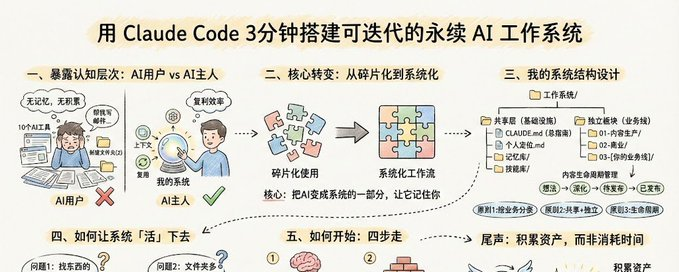

# Source: https://x.com/Roland_WayneOZ/status/2018946199106326726?s=20


---

(1) X 上的 Roland的思考日记：“我如何用 Claude Code 在3分钟搭建一套可迭代的永续 AI 工作系统 ” / X


[](/Roland_WayneOZ)

[Roland的思考日记](/Roland_WayneOZ)

[@Roland\_WayneOZ](/Roland_WayneOZ)

[](/Roland_WayneOZ/article/2018946199106326726/media/2018946165258264576)

我如何用 Claude Code 在3分钟搭建一套可迭代的永续 AI 工作系统

9

137

518

[5.7万](/Roland_WayneOZ/status/2018946199106326726/analytics)

本文由本人内容生成系统生成，我本人写不出这么好的文章，谢谢CC。可以不用看完，点个赞，收藏，复制全文然后让Claude Code帮你操作就行了，我已经设置了这个功能。

一、你用 AI 的方式，暴露了你的认知层次
=====================

我见过太多人用 AI 的方式是这样的：

订阅了 10 个 AI 工具，每个月花 500 块。用的时候还是打开 ChatGPT，输入「帮我写一封邮件」。

每次写文章都要重新解释一遍：「我是做 XX 的，我的读者是 XX，我的风格是 XX……」AI 永远不记得上次聊了什么。

桌面上躺着「新建文件夹」「新建文件夹(2)」「临时」「真的临时」。找一个上周写的文档，要翻 20 分钟。

上个月写出了一篇爆款，这个月想复制，发现当时用的框架、金句、数据，全都找不到了。

这不是在用 AI，这是在被 AI 用。

说实话，大多数人用 AI 的方式，和用 Word 没有本质区别。

都是「打开 → 输入 → 输出 → 关闭」。

没有记忆，没有积累，没有系统。

每次都从零开始。

你用 AI 的方式，决定了你是「AI 的主人」还是「AI 的用户」。

大多数人只是后者。

二、从「用户」到「主人」：一个核心转变
===================

「用户」和「主人」的区别是什么？

用户：AI 是一个工具，用完就关。

主人：AI 是一个系统的一部分，它知道我是谁、我在做什么、我做过什么。

用户每次都在教 AI 认识自己。

主人让 AI 记住自己，然后在这个基础上工作。

用户的效率是线性的：做一件事，花一份时间。

主人的效率是复利的：做一件事，同时在给系统添砖加瓦。

从「用户」到「主人」，核心转变只有一个：

把碎片化的 AI 使用，变成系统化的 AI 工作流。

怎么做？

我用 Claude Code 搭建了一套系统。

现在，我的所有工作都在一个目录下完成。AI 知道我的上下文，内容可以复用，方法论可以沉淀。

接下来，我会公开这套系统的设计思路。

三、我的系统长什么样
==========

在讲具体结构之前，先说三个设计原则。

原则1：按业务流程分类，不是按文件类型
-------------------

错误的分类方式：

```
文档/
图片/
视频/
PDF/
```

正确的分类方式：

为什么？

因为你工作的时候，思考的是「我要做什么」，而不是「这个文件是什么格式」。

当你要写一篇文章时，你需要的是：选题、素材、方法论、历史数据。

这些东西应该放在一起，而不是散落在「文档」「图片」「PDF」三个文件夹里。

原则2：共享层 + 独立板块
==============

你的工作可能有多个方向。

它们是独立的，但有些东西是共享的：

- 个人定位（你是谁）

- AI 的使用说明

- 长期记忆

- 技能库

所以架构应该是这样的：

```
工作系统/
├── 共享层
│   ├── CLAUDE.md（AI总指南）
│   ├── 个人定位.md
│   ├── 记忆库/
│   └── 技能库/
│
├── 独立板块
│   ├── 01-业务线A/
│   ├── 02-业务线B/
│   └── 03-业务线C/
```

共享层是「基础设施」，独立板块是「业务线」。

这样设计的好处：

1. AI 只需要一个工作目录，不用切换上下文

2. 跨领域的知识可以互相借鉴

3. 每个业务线又有清晰的边界

原则3：内容的生命周期管理
=============

这个部分我参考了dont哥的公开内容进行的一些优化，感谢dont哥。

如果你做内容创作，一篇内容从想法到发布，经历这些阶段：

想法 → 深化 → 待发布 → 已发布

所以选题管理可以这样设计：

```
选题管理/
├── 00-选题记录.md    # 碎片想法收集箱
├── 01-待深化/        # 有潜力，待写成文稿
├── 02-待发布/        # 文稿完成，待发布
└── 03-已发布/        # 已发布，含数据记录
```

每个阶段有明确的入口和出口。

想法不会丢失，进度可以追踪，数据可以沉淀。

完整结构参考
======

```
工作系统/
│
├── CLAUDE.md                    # AI总指南
├── 个人定位.md                   # 你是谁，做什么
├── 控制面板.md                   # 系统入口
│
├── 记忆库/                       # 长期记忆
│
├── 01-内容生产/
│   ├── 选题管理/
│   │   ├── 00-选题记录.md
│   │   ├── 01-待深化/
│   │   ├── 02-待发布/
│   │   └── 03-已发布/
│   ├── 素材库/
│   │   ├── 核心概念库/
│   │   ├── 金句库/
│   │   └── 案例库/
│   ├── 数据统计/
│   └── 方法论/
│
├── 02-商业/
│   ├── 业务模式/
│   ├── 客户交付/
│   └── 课程/
│
├── 03-[你的业务线]/
│
└── 04-技能库/
    ├── 内容生产/
    ├── 商业/
    └── 通用/
```

四、如何让系统「活」下去
============

系统不是设计出来的，是用出来的。

很多人搭建系统的问题是：花了三天设计完美结构，然后再也没打开过。

系统要「活」，就要不断迭代。

我用三个问题来判断「什么时候需要调整结构」：

问题1：我找东西的时候，第一反应去哪里找？
---------------------

如果你的第一反应和实际位置不一致，说明分类逻辑有问题。

比如，你一开始把「投资笔记」放在「学习」板块下面。但每次找的时候，你都会先去根目录找。

这说明在你的心智模型里，「投资」是一个独立的事情，不是「学习」的子集。

那就应该把它独立出来。

好的分类，应该符合你的直觉，而不是逻辑上的「正确」。

问题2：这个文件夹，我多久没打开过了？
-------------------

如果一个文件夹超过一个月没打开，要么是：

- 这个分类不符合你的工作流

- 这个事情你已经不做了

不管哪种情况，都应该调整。

系统是为你服务的，不是让你服务它。

问题3：新内容放进去的时候，我会犹豫吗？
--------------------

如果你拿到一个新文件，不知道该放哪里，说明分类边界不清晰。

好的分类，应该让你「不用思考」就知道放哪里。

如果经常犹豫，就需要重新定义分类的边界。

五、如何开始
======

如果你也想搭建这样的系统，我的建议是：

1. 先想清楚你的「业务线」
--------------

问自己：我日常做的事情，可以分成哪几个大类？

不要超过 6 个。太多了管不过来。

2. 从一个小流程开始
-----------

不要一开始就追求完美。

先解决一个具体痛点：

- 选题总是丢失 → 先建「选题管理」

- 素材找不到 → 先建「素材库」

- AI 不记得上下文 → 先写「

[CLAUDE.md](//CLAUDE.md)

」

3. 让 Claude Code 帮你搭建
---------------------

你可以把这篇文章发给 Claude Code，然后说：

```
我想搭建一套类似的工作系统。

我的情况是：
- 我做的事情有：[列出你的业务线]
- 我目前的痛点是：[列出具体问题]

请帮我：
1. 设计适合我的目录结构
2. 创建核心文件
3. 定义工作流
```

Claude Code 会根据你的情况，帮你定制专属系统。

4. 边用边迭代
--------

用了一周后，问自己那三个问题：

- 找东西的时候，第一反应对不对？

- 有没有文件夹很久没打开？

- 新内容放进去会不会犹豫？

根据答案调整结构。

记住：系统不是设计出来的，是用出来的。

尾声
==

这套系统的核心价值：

1. 记忆系统：AI 知道你以前做过什么

2. 素材复用：好的框架、表达、案例，可以反复使用

3. 方法论沉淀：每次工作都在给系统添砖加瓦

4. 可迭代：结构会随着你的需求进化

碎片化工作：每次都从零开始，效率低，质量不稳定。

系统化工作：每次都在复用和迭代，效率高，质量稳定。

大多数人用 AI，是在消耗时间。

少数人用 AI，是在积累资产。

区别就在于：你有没有一套系统。

如果这篇文章对你有帮助，欢迎转发给也在用 AI 的朋友。

想发布自己的文章？

[升级为 Premium](/i/premium_sign_up)

[下午3:14 · 2026年2月4日](/Roland_WayneOZ/status/2018946199106326726)

·

[5.7万

查看](/Roland_WayneOZ/status/2018946199106326726/analytics)

9

137

518

971

相关

[查看引用](/Roland_WayneOZ/status/2018946199106326726/quotes)