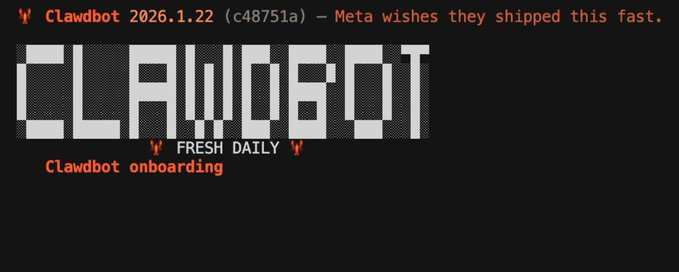
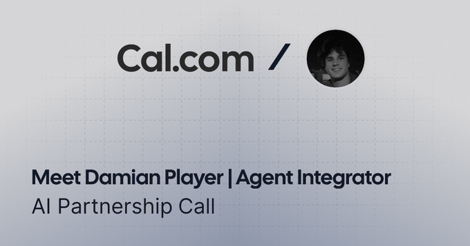

# Source: https://x.com/damianplayer/status/2015105669620269373?s=20

---

[Damian Player](/damianplayer)

[@damianplayer](/damianplayer)

Clawdbot looks intimidating. it's not. here's the full setup in 30 minutes.

1,290

1,677

1万

[378万](/damianplayer/status/2015105669620269373/analytics)

everyone's talking about clawdbot. twitter's going crazy. people posting screenshots of their bots clearing inboxes, scheduling meetings, researching companies while they sleep.

and you're sitting there wondering if you missed the window.

you didn't. here's how to set it up before the hype dies down and you forget.

what clawdbot actually is
-------------------------

clawdbot is an open-source AI assistant that runs 24/7 on a server. you talk to it through whatsapp or telegram. it does actual work. clears your inbox. schedules meetings. researches companies. follows up with leads. writes content. manages your calendar.

one guy has his hooked up to github, google drive, and gmail. he tells it "analyze my site, write a blog post, update my metadata, then draft a linkedin post." it does all of it. by voice. while he does other things.

another guy has it check him into flights, monitor stock prices, and send alerts when something needs attention.

most AI tools answer questions. clawdbot does work.

why most people won't set this up

they think it's technical. terminal commands. servers. API keys.

sounds intimidating. feels like you need to be a developer.

you don't.

the whole setup is copy-paste. the wizard walks you through everything. if you get stuck, screenshot where you are and send it to chatgpt. ask "i'm trying to set up clawdbot and i'm stuck here. what do i do?" it tells you exactly what buttons to press.

that's what non-technical people do. works every time.

you're not learning to code. you're learning to manage an AI that works for you 24/7.

the 30-minute setup
-------------------

step 1: get a free server (5 min)

clawdbot needs to run somewhere 24/7. AWS free tier works.

go to 

[aws.amazon.com](//aws.amazon.com)

. create account. search "EC2". click "launch instance". name it anything. select ubuntu. search "free" for instance type, pick the 8gb option. launch. click your instance ID. click connect twice.

you're in a terminal. looks scary. it's not.

step 2: install clawdbot (2 min)

paste this one line:

curl -fsSL 

<https://clawd.bot/install.sh>

 | bash

wait 2 minutes. that's the only command. everything else is clicking through a wizard.

step 3: run the wizard (10 min)

wizard starts automatically. select "quick start". choose "anthropic". select "token paste setup".

it asks you to run a command on your local computer to get a token. open a new terminal, paste the command, copy the token back.

select "opus 4.5" as your model. select "telegram bot" as your channel.

step 4: create your telegram bot (5 min)

open telegram. search "

[@botfather](https://x.com/@botfather)

". send /newbot. name your bot. copy the token. paste into wizard.

search "

[@useridbot](https://x.com/@useridbot)

". copy your user ID. paste into wizard.

this makes sure only you can talk to your bot.

step 5: give it an identity (5 min)

clawdbot asks you questions in telegram:

what should i call you? what should you call me? what's my purpose? what timezone are you in?

answer these. your assistant is now alive.

your first 3 wins (next 5 minutes)
----------------------------------

you just set up clawdbot. here's how to see it work immediately.

win 1: the inbox testtell it: "check my last 10 emails and tell me which ones actually need a response."

win 2: the research testtell it: "research [company you're curious about] and give me a 3-bullet summary of what they do."

win 3: the reminder testtell it: "remind me to [something you've been putting off] tomorrow at 9am."

all three take under 60 seconds. you'll have results before you finish your coffee.

now you trust it. now you start giving it real work.

the cost

$20/month claude subscription. free AWS server.

a human VA costs $500-2000/month and sleeps 8 hours. clawdbot runs 24/7 for $20.

what to do after the quick wins
-------------------------------

add brave search so it can search the web. go to 

[brave.com/search/api](//brave.com/search/api)

. get a free API key. tell your bot "set up brave search with this API key."

connect your tools over time. github. google drive. gmail. calendar.

then give it real tasks:

* "research [company] and give me a one-pager"
* "remind me to follow up with [name] in 3 days"
* "draft a linkedin post about [topic]"
* "check my calendar and find time for a call tuesday"
* "summarize this article and draft a thank you email to the author"

the skills are additive. every day it gets better.

if something breaks, tell your bot "fix this" and paste the error. it usually fixes itself.

use voice
---------

you don't have to type. use voice notes on telegram or whatsapp. talk to clawdbot while you walk, drive, do other things.

some people run multiple agents in slack. set off one task, start another. they run in parallel.

the window
----------

most people will screenshot this, bookmark it, and never set it up.

don't be most people.

the gap between "has a 24/7 AI assistant" and "doesn't" is about to get massive. the people setting up clawdbot today will have a head start everyone else spends months catching up on.

check 

[clawd.bot](//clawd.bot)

 for docs.

want the complete cheat sheet?

i put together a one-page clawdbot setup guide with:

* every command you need to copy-paste
* the full telegram bot setup walkthrough
* 20+ ready-to-use prompts for your first week
* troubleshooting fixes for common errors
* the skill install checklist (brave, gmail, calendar, github)

no fluff. just the exact steps on one page you can pull up on your phone while you set it up.

rt + follow+ reply "CLAWDBOT" and i'll send it over (must be following so my agent can DM)

想发布自己的文章？

[升级为 Premium](/i/premium_sign_up)

[上午12:53 · 2026年1月25日](/damianplayer/status/2015105669620269373)

·

378.9万

查看

1,290

1,677

1万

2.8万

---

[Damian Player](/damianplayer)

[@damianplayer](/damianplayer)

·

[1月25日](/damianplayer/status/2015121730298093639)

you know business owners. we build AI systems. you close the deal and we handle the delivery.
lets partner:

[

AI Partnership Call | Damian Player | Agent Integrator | Cal.com](https://t.co/lbk9KSPZRx)

[来自 cal.com](https://t.co/lbk9KSPZRx)

4

2

64

[13万](/damianplayer/status/2015121730298093639/analytics)

---

[Damian Player](/damianplayer)

[@damianplayer](/damianplayer)

·

[1月25日](/damianplayer/status/2015135969326801160)

launching a youtube channel for non-technical people who want to use AI without learning to code.
subscribe so you don't miss it:

[youtube.com

Damian Player

AI for non-technical people. 10x your life and business without writing code.](https://t.co/2ahv6kyybO)

5

3

72

[6.3万](/damianplayer/status/2015135969326801160/analytics)

---

[X-Qlusive](/X_Qlusive)

[@X\_Qlusive](/X_Qlusive)

·

[1月25日](/X_Qlusive/status/2015143489802006960)

Jezuz. People without any fundamental knowledge about anything what a terminal actually does are now trying to setup something which they never understand. So great times for hackers. I can just imagine what this might cause if any hacker gets root access…

5

1

72

[2.1万](/X_Qlusive/status/2015143489802006960/analytics)

---

[Damian Player](/damianplayer)

[@damianplayer](/damianplayer)

·

[1月25日](/damianplayer/status/2015148710653555132)

your fun at parties arent ya?

7

79

[1.8万](/damianplayer/status/2015148710653555132/analytics)

---

[Outgrow](/OutgrowCo)

[@OutgrowCo](/OutgrowCo)

广告

The secret sauce behind TESLA's marekting strategy. That can be applied to any business small or big.

[来自 outgrow.co](https://outgrow.co/assistant-ai/?utm_source=Twitter&utm_medium=paid-social&utm_campaign=OG+Tesla+Veo&twclid=26041mpi6etp20y0fud4e07cy)

98

788

[618万](/OutgrowCo/status/2001946642078212342/analytics)

---

[Matías Nicolás Sosa ](/mnsosa_ai)

[@mnsosa\_ai](/mnsosa_ai)

·

[1月25日](/mnsosa_ai/status/2015294185650163940)

i dont understand the hype. i can do the same without clawdbot

3

25

[1万](/mnsosa_ai/status/2015294185650163940/analytics)

---

[Damian Player](/damianplayer)

[@damianplayer](/damianplayer)

·

[1月25日](/damianplayer/status/2015326031373111453)

just let us cook

3

7

[1万](/damianplayer/status/2015326031373111453/analytics)

---

[Ƀ](/CryptoChrisG)

[@CryptoChrisG](/CryptoChrisG)

·

[1月25日](/CryptoChrisG/status/2015204367490539880)

[@2140data](/2140data)

 here’s a write up

1

3

[9,818](/CryptoChrisG/status/2015204367490539880/analytics)

---

[Damian Player](/damianplayer)

[@damianplayer](/damianplayer)

·

[1月25日](/damianplayer/status/2015205571008364695)

give it a reaaad

3

[9,229](/damianplayer/status/2015205571008364695/analytics)

---

[Rafael BAR ](/rafabarezende)

[@rafabarezende](/rafabarezende)

·

[1月26日](/rafabarezende/status/2015469349415375248)

I need an AI that work with Excel spreadsheets
Do you have one?

2

1

[3,027](/rafabarezende/status/2015469349415375248/analytics)

---

[Damian Player](/damianplayer)

[@damianplayer](/damianplayer)

·

[1月26日](/damianplayer/status/2015474022226571629)

Claude can.

1

[2,785](/damianplayer/status/2015474022226571629/analytics)

---

[PalantirVPN](/PalantirVPN)

[@PalantirVPN](/PalantirVPN)

广告

热门视频秒开不卡！安全稳定的网络加速工具，让加载更快、更安心。免费试用中。

[来自 xiaodiqiuyi.com](http://www.xiaodiqiuyi.com/?twclid=273hhepg9r1y41atzl07wym1r)

2

95

[388万](/PalantirVPN/status/1988549373178028252/analytics)

---

[Preston Holland ](/prestonholland6)

[@prestonholland6](/prestonholland6)

·

[1月26日](/prestonholland6/status/2015455780665766060)

If I’ve already got a Mac mini driving my workstation, do I need a dedicated one for Clawdbot? Any advice on spec?

1

[4,258](/prestonholland6/status/2015455780665766060/analytics)

---

[Damian Player](/damianplayer)

[@damianplayer](/damianplayer)

·

[1月26日](/damianplayer/status/2015456449082634467)

yes, your current mac mini works fine.
clawdbot isn’t resource heavy. the AI runs on anthropic’s servers, your machine just sends requests.
dedicated only makes sense if you want it fully isolated or running multiple agents.
ps: let’s do a podcast in a jet about AI. would be

显示更多

5

[3,024](/damianplayer/status/2015456449082634467/analytics)