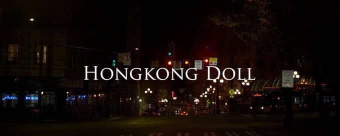
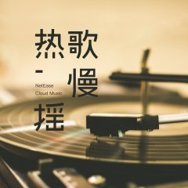

# Source: https://x.com/hongkongdoll/status/2015636441611510195?s=20

---

[HongKongDoll](/hongkongdoll)

[@hongkongdoll](/hongkongdoll)

曾经我也想过一了百了，这几年我和两个他的“爱情故事”

787

738

5,492

[402万](/hongkongdoll/status/2015636441611510195/analytics)

最近我从独自旅行回到家中，回归账号的管理工作，这一次度假持续了大概40多天，我去了五个国家，七个城市，打算用旅行来找到我想做的事，想去的地方，但我并没有成功，到了临近结束时我不知道下一站该去哪里，所以我选择了回家。回到家里突然间有一阵很难受的感觉，我不知道那个是孤独还是什么，但是有种难以言喻的失落或者失望，这些让心里堵住的情绪莫名其妙地萦绕着我，像一张不断扩张的藤蔓巨网将我牢牢锁住，过去一整年，我从来没有下笔写过搞钱以外的东西，直到前两天我在推上随机刷到一条抖音视频，“如何辨别自己的女人有没有下过海”，这一条内容不仅打开了我的回忆而且激发了我想下笔的欲望。

这一篇我没有想要写投机，策略，套利之类的东西，过去两年我好像从来没有认真地从人，或者说从女人的角度来审视自己，所有关于我的一切都是围绕生意，流量，订阅，钱。一个人之后我习惯把柔弱用冷静和果决包裹起来，把感性的一面完全抛弃，只做理性的取舍，只做利益最大化的事情，刀哥这种梗也是我希望各位可以忘记我的性别，方便我继续输出内容，但这一篇随笔，或者说回忆，是我来币圈之前和之后发生的，但又和币圈没什么关系的，关于我和两个他的“爱情故事”。正好和黄瓜猫聊天的时候说这行情回撤得不想写赚钱了，甚至想写感情，所以花了一下午写我的干瘪的“情史”。

《曾经我也想过一了百了》是我有段时间最爱听的歌，写这篇时也是一直在听，中岛美嘉的声音神奇地具有破碎感同时又很有力量。你看这篇的时候拿来听，也许某个瞬间我们的精神会突破时空限制突然同频，也许你会看到假面下我想表达的真实的我。

第一个他

屋子里没有开灯，窗帘只拉了一半，我们的家在公寓的第二层，外面的路灯把墙面照出一块模糊的影子。我蹲在地上整理行李箱，他的旧相机就放在里面。很沉，边角被磨得有些旧。我原本只是想帮他收好，我按下开机键，惊讶相机还有电的时候，屏幕亮起的光突然让我有点眩晕。我没有立刻意识到发生了什么。心跳忽然变得很轻，轻到我甚至怀疑是不是停了。照片，视频不断从相机里出现，我想不起来自己看了多久。等我反应过来的时候，窗外已经快天亮了。

遇到那个他是在8年前的一个下午，我那年刚大一，一个人在西雅图的一家画廊里闲逛。那天其实没有什么特别的安排，只是课后随便走进去躲雨，西雅图的秋天阴阴的，四处是湿润的泥土气息，我喜欢下雨的感觉，所以选择了西雅图。展厅里很安静，灯光有点冷，脚步声被地毯压得很轻，时不时有人进来，淅淅沥沥的小雨声通过带铃铛的玻璃木门缓缓飘进来。我在一幅画前站了很久，那是一幅颜色很淡的油画，背景被处理得模糊，画面中央却是一个清晰的亚洲女孩，神情有点厌世，又有点脆弱。破碎感，是她给我的第一印象。画名写在旁边，China Doll。我当时并不知道这个名字以后会陪我走那么远，那么久，是的，我的ID就是源于这幅画的名字。他就是在那时候走到我旁边的，没有突然靠近，只是和我保持着一点点礼貌的距离，说了一句，Can I take a photo of you？我转过头，看见他背着相机。他说他也是学生，所以表露了自己也是学生的身份。那一刻其实没有任何浪漫的氛围。只是两个陌生人很自然地聊了几句。后来他为把照片发给了我，找我要了ins，我们各自回到了自己的生活。

之后的很长一段时间，我们的联系都不算频繁。偶尔聊天，偶尔点赞，偶尔在 ins 上看到对方的日常。他拍的照片很好看，街角，日落，路牌，窗户。我会停下来多看一会儿。但也仅此而已。后来我去了香港交流几个月，时差让聊天变得断断续续，有时隔一天才回一句，他会聊他的猫，学校的作业，新的影展，还有捉弄他的兄弟，他有时在拙劣地找着话题，想要让联系持续不断下去，让我感觉他还挺可爱的，也正是那种若即若离，让我一直记得他。直到香港交流快结束的某一天，他突然出现在校门口。我从远处看到他的时候，第一反应甚至是不真实，因为我从来没跟他约好过，也没说过的我的时间表，他得在门口等多久啊！他站在人群里，有点局促地抱着相机，看到我之后笑得很明显。那天他向我表白。我记得自己当时没有哭，也没有太激动。只是突然觉得，这个人好像真的走了很远的路来找我。

回到美国之后，我们在一起了。那是一段很干净的时间。上课、吃饭、看电影。他会帮我拍照，也会认真地修图。有时候我坐在床上写作业，他就在一旁整理相机里的素材。我喜欢他专注的样子。突然有一次，他随口跟我说起一个pornhub账号 Tokyo Dairy，说那对情侣自拍很火。他说，如果是我们，一定会拍得更好，咱们直接来个hongkongdoll，立刻横扫p站，没准还能赚个房租。那句hongkongdoll他提过很多次。有时是玩笑。有时是随口一提。一年里，他没有真的做什么。所以我也从来没有当真。直到疫情来了，世界忽然被按下暂停键。学校关闭，课程变成线上。日子被拉得很长。那段时间我们几乎每天待在一起。有一天在他家，我笑着说了一句：“你的那个hongkongdoll计划什么时候上线啊？”我本来只是调侃。他突然扑过来过来，动作很快，像是早就想过这一幕。那一刻我心里其实有一点慌，但更多的是信任。我以为那只是属于我们的亲密。我们自此有了我们第一条视频，hongkongdoll的频道也是那时候开通的。

后来一切开始变得认真起来。突然bug导致的爆火，暴涨的订阅收入，推着我们不停产出越来越难制作的视频，他开始写剧情、分镜、台词，我们一起讨论剧情，讨论如何拍摄，一条一条记在本子上。我常常坐在旁边，看他低头写字。他说那是他真正想表达的东西，我相信了。我们慢慢被更多人看到，名字被提起，账号开始有重量。即使后来出现过开盒、勒索、甚至学校的处分，我也始终没有过退缩，还是想跟他在一起。一如我之前写过的一篇，我像在命运的洪流中恰巧抓住了一根稻草，我的故事像一个幸运的错误。我从来没有怀疑过我们的关系，没想过有一天我们会分开。因为他写出过一句旁白，那是出现在我们第一部长篇中的结尾的最后一段：

“我其实想讲一个目的不纯的纯爱故事，我希望每一个人都可以跟自己的喜欢的人一起做爱做的事情，即使一开始的目的可能并不太单纯，但当两个人互相吸引的时候，甚至是萌生出爱意的时候，我觉得这个爱在发展过程中也会无限接近纯粹和完美，而每个人都有追求爱和被爱的权利，愿你找到一个你爱的ta”

我当时觉得，那说的就是我们。动机或许复杂，但爱是真的。我也以为那段话是写给我的。

直到有半年后的某天晚上，我收拾行李箱发现他的旧相机。一个突然崩塌的瞬间，我的喉咙感觉像被人慢慢抽走空气，一阵眩晕。我能感觉到我的血液在凝固，手脚渐渐失去温度，我想我看到太多东西了。照片，视频，大量的，和我差不多年纪女孩子的，照片和视频，在同一个地方，同一个房间，同一张床上。还有我们熟悉的那只猫。从三年前开始，他就不断在拍，我们认识的时间段在拍，甚至我们在一起之后的时间点也有拍别人，还有很多是偷拍。我脑子里面不停闪过无数的词条，如果他就爱好这个呢，都是以前的事也许没关系呢，他到底是谁，我该怎么办… 可能，可能他现在步入运营的正轨了就不会再想着别人了呢？也许我就是那个第一个同意公开出镜的傻姑娘，也许… 我呼吸越来越急促，拼命想要找回空气中的氧气，可我只能跟一只搁浅的鱼一样，不停摆动但始终无法回到属于我的空间。我哑着，并没有哭闹，只是不眠，只是一阵阵反胃，身体的痉挛让我的胃灼烧不止，只是觉得在一个屋子里生活的人突然成了一个我不认识的陌生男人。

第二天，我像往常一样给他做早饭，他从后面抱过来问我有没有睡好，我没有说话，因为我一整夜都没有睡。我默默问他记不记得我们第一天见面在ins上聊了什么，他想了半天没有答上来。你当然不记得，因为加我那天你还约了别的女孩子。

“快吃吧，今天还有挺多文件要整理。Crypto那边你也教教我怎么开户，之后我想自己试试。”

第二个他

手机屏幕亮起的时候，房间里还没完全天亮。窗外的风声有点急，像是海浪反反复复不停在岸边迅游。邮件标题，简短但又残酷，完全不像是写给一个认识的人。我盯着那行字看了很久，一时间没有点开的勇气。那种感觉很熟悉，像站在泳池边缘，明知道水很深，却还是被人推了一把栽了进去。我点开了。那一瞬间，只是忽然觉得房间变得很空，像所有窗户同时被打开，风灌进来，却没有方向，只想要逃离。

我其实是在很久以前来到夏威夷的。第一段分手让我恢复了很久，我不敢和任何人说我身上发生的事，也不敢开始新的约会。我不知道认清一个人之后的妥协会带来什么，大抵像是心里被戳了很多个洞，任自己再做什么去弥补也填不满，分开一年的时间里我除了搞钱就是搞钱，没有任何其他。我和第一个他在夏威夷结束，但阳光沙滩是最能治愈伤痛的地方。在那里，夏天的每一个早晨都像是最后一个早晨，晚霞也是。那里和西雅图完全不同，西雅图的雨是向下落的，而夏威夷的阳光是从四面八方涌过来的。花是热烈的，海是湛蓝的，风带着咸咸的海盐味道。一切都太鲜活了，鲜活到让人暂时忘记自己曾经破碎过。这一切交织成生机勃勃的浪漫，同这个他一起闯进我的心里。

第一次见到这个他是在下午两点。沙滩被太阳烤得发烫，脚踩上去会微微刺痛。他穿着紧身的潜水服，抱着冲浪板走到我面前，笑得有点漫不经心。You are 20 minutes late，语气不像责怪，更像调侃。作为教练，他并没有真的不高兴，毕竟迟到损失的，是我自己的时间。他很健谈，也很敏锐，亚洲人的长相却没有任何亚洲人的习惯和思维。不过两节课，他就察觉出我身上那种刻意的疏离，不久就猜出我有过一段令人不快的感情。我当时没有否认。只是看着远处的浪，没有说话。

也许是在夏威夷土生土长的原因，他的性格明亮又直接。是他带我去看跨年的烟花，陪我去欧胡潜水，凌晨开车带我去追银河。有一天他说要带我去看日出。那天凌晨五点多，雾气重得几乎看不见路。我裹着毯子坐在副驾上，觉得自己白跑一趟。他递给我一个保温杯，问我要不要打赌今天能不能看到太阳。我说赌就赌。这么大的雾，怎么可能散。五点三十二分。雾忽然开始后退。像是被谁轻轻掀开。他说，我赢了，今晚我们又可以一起吃饭了。我打开杯子。里面是热巧克力。是我喜欢的那种。那一刻，太阳从海平线冒出来，光铺满整个世界。我突然意识到，我好像，又开始喜欢一个人了。可我不敢，我不敢把自己完全交出去。关于我的过去，我几乎不提也不能提。我有专门的工作备用手机，电脑也从不让他碰。我不怎么买东西，不穿大牌，吃饭坚持 AA。我害怕任何一点异常，都会暴露我身上的裂纹。我怕他知道，我和前男友的视频曾经被上亿人看过，我每天在加密货币里浮沉五位数。我不是他以为的那种简单干净，可以被轻松拥抱的人。

我以为只要建立好边界，过去事情就不会再发生了。可他太敏感了，他知道我有事情瞒着他。他察觉我始终没有完全走近，一开始他理解，以为我只是没准备好。可次数多了，理解会变成疲惫。在一次争执里，他说我卑劣，说我一边靠近他取暖，一边却连真心都不肯交出来。我没有反驳，只是忽然觉得，也许他说得对。我道如是，我这样的人，许是不配这样炽烈干净的人来爱我。

那段关系就这样停在了半路。没有正式开始，也没有好好结束。后来他联系过我很多次，我以为是舍不得，直到那封邮件出现。那封勒索信里是蹩脚的机翻中文，那个邮箱的名字看着很眼熟，直到我发现telegram给我手机推荐通讯录推荐好友里也有一样的昵称。才发现原来那个号是他的，那封生日收到的勒索信正是他的杰作。我不知道他是什么时候看见我的另一部手机的，也不知道他是什么时候起了勒索的念头。是爱而不得，还是见钱眼开，我已经没办法分辨。我只记得那天夜里，我迅速打包行李。租约还没到期，可我一刻都不想再待下去。我拖着箱子离开那座城市的时候，像极了当初搬来到这里的样子。仓皇，没有方向。

他甚至愚蠢到tg不隐藏手机号，愚蠢到让tg推荐，愚蠢到地用了和tg一样的昵称的邮箱来尝试勒索我。那一刻，我忽然觉得有点荒谬。原来人就是这样，会反复使用熟悉的名字，反复喜欢上带着劣性的人，反复伤心，反复在城市之间迁徙，然后在某一个夜里，顾影自怜，写下一段伤感的文字。

后记

有些事情很荒诞，我想尽量用我平静的语言随手写下这些回忆，这些回忆也伴随了我整个网络生命的开启，高潮，或许也是结束。“如何辨别自己的女人有没有下过海” 可能是一个伪命题，有的人一辈子在体制内，却灵魂腐烂，有的人在最泥泞的地方待过，却渴望真爱，愿意相信美好。恶劣如他，恶劣如他，依旧有能力写出“每个人都有追求爱与被爱的权利”，不完整如她，也始终愿意为自己走过的每一步负责。接不接受一个人，或许需要从撕掉ta身上的标签开始。

愿你能找到你爱的那个ta。

想发布自己的文章？

[升级为 Premium](/i/premium_sign_up)

[下午12:02 · 2026年1月26日](/hongkongdoll/status/2015636441611510195)

·

402.9万

查看

787

738

5,492

2,533

---

[HongKongDoll](/hongkongdoll)

[@hongkongdoll](/hongkongdoll)

·

[1月26日](/hongkongdoll/status/2015661799798927817)

忘记写了，我用的这篇的封面，截取自文中引用那段第一个他写的台词的那集，开场的空镜，他是我见过少数非常有才华但内心视他人如蝼蚁的人，即使这样我依然喜欢我们一起做过的东西，我对我做过的选择既后悔又不后悔。

21

8

365

[22万](/hongkongdoll/status/2015661799798927817/analytics)

---

[Ryan](/Ray_Chou1212)

[@Ray\_Chou1212](/Ray_Chou1212)

·

[18小时](/Ray_Chou1212/status/2015763588888109517)

很真挚的文章，有点21年的“你的渡口”的感觉

2

8

[3.9万](/Ray_Chou1212/status/2015763588888109517/analytics)

---

[HongKongDoll](/hongkongdoll)

[@hongkongdoll](/hongkongdoll)

·

[18小时](/hongkongdoll/status/2015765046874255710)

我很惋惜她。

1

5

[3万](/hongkongdoll/status/2015765046874255710/analytics)

---

[林克Clean](/CryptoSociety42)

[@CryptoSociety42](/CryptoSociety42)

·

[19小时](/CryptoSociety42/status/2015742338648404446)

19年大熊市，我低点卖了很多ETH，那时候有点抑郁状态，就靠这首歌走过来的，最喜欢这个版本，中岛美嘉用跺脚来找节奏，虽然破音但是非常有生命力。
你还是太会抓细节了，有些描述画面感太强，“有些笨拙的故意找话题”，还有“愚蠢到不知隐藏TG手机号”，这愚蠢我也犯过，还是你提醒我了

显示更多

[y.music.163.com

僕が死のうと思ったのは (2015演唱会现场版)（曾经我也想过一了百了） - 中島美嘉 - 单曲 - 网易云音乐](https://t.co/wAq70cN0YP)

2

17

[2.7万](/CryptoSociety42/status/2015742338648404446/analytics)

---

[HongKongDoll](/hongkongdoll)

[@hongkongdoll](/hongkongdoll)

·

[18小时](/hongkongdoll/status/2015761305391473146)

今夜单曲循环它！
——我在币圈聊天最多的朋友

1

13

[1.9万](/hongkongdoll/status/2015761305391473146/analytics)

---

[Pickle Cat](/0xPickleCati)

[@0xPickleCati](/0xPickleCati)

·

[20小时](/0xPickleCati/status/2015730636967891174)

真的respect，不是每个人都能把伤疤的痛运化成努力前进的能量的。希望姐姐能永远干自己爱做的事情，永远自由，永远潇洒。

4

109

[2.4万](/0xPickleCati/status/2015730636967891174/analytics)

---

[HongKongDoll](/hongkongdoll)

[@hongkongdoll](/hongkongdoll)

·

[18小时](/hongkongdoll/status/2015757110374445412)

本来就是你想看写给你看的哈哈，一起活成自己喜欢的样子！

2

34

[1.9万](/hongkongdoll/status/2015757110374445412/analytics)

---

[咕噜Gulu](/dak821122)

[@dak821122](/dak821122)

·

[1月26日](/dak821122/status/2015645723291996535)

这篇不是文章的文章，更像是我看了一部日式纯爱电影，后劲拉满，全是细节，看完感觉我是主角走不出来

1

95

[3.7万](/dak821122/status/2015645723291996535/analytics)

---

[HongKongDoll](/hongkongdoll)

[@hongkongdoll](/hongkongdoll)

·

[1月26日](/hongkongdoll/status/2015646298041434525)

跟我看完蕾塞篇同一个感觉。

2

50

[3万](/hongkongdoll/status/2015646298041434525/analytics)

---

[表弟想自由BNB](/Cady_btc)

[@Cady\_btc](/Cady_btc)

·

[1月26日](/Cady_btc/status/2015641974150500399)

或许 标题换成如何辨别自己的女人有没有下过海 会更吸睛 更爆

2

2

[2.6万](/Cady_btc/status/2015641974150500399/analytics)

---

[HongKongDoll](/hongkongdoll)

[@hongkongdoll](/hongkongdoll)

·

[1月26日](/hongkongdoll/status/2015642876370186277)

那不是我的随笔了 而是二元骂战

33

[2.3万](/hongkongdoll/status/2015642876370186277/analytics)

---

[紫夜](/0xZiye)

[@0xZiye](/0xZiye)

·

[1月26日](/0xZiye/status/2015641965392544045)

女孩子确实是容易受伤害的那一个。。这方面社会对男性还是太宽容，又对女性太不宽容了。。 hard to say ....

3

1

49

[2.8万](/0xZiye/status/2015641965392544045/analytics)

---

[HongKongDoll](/hongkongdoll)

[@hongkongdoll](/hongkongdoll)

·

[1月26日](/hongkongdoll/status/2015659414317871292)

多方面原因，痛苦从来不是一元二元的，自己能做自由选择的时候就要为选择负责。

1

1

43

[2.2万](/hongkongdoll/status/2015659414317871292/analytics)

---

[LaserCat397.eth](/BitCloutCat)

[@BitCloutCat](/BitCloutCat)

·

[19小时](/BitCloutCat/status/2015754774688534916)

你的文字很痛

2

13

[1.8万](/BitCloutCat/status/2015754774688534916/analytics)

---

[HongKongDoll](/hongkongdoll)

[@hongkongdoll](/hongkongdoll)

·

[18小时](/hongkongdoll/status/2015759032879894551)

刚醒……
看到猫哥群里说的了 谢谢痛是表象，我更多是想释放自己，回撤的压力憋久了找一个口子释放情绪

1

16

[1.5万](/hongkongdoll/status/2015759032879894551/analytics)

---

[凉粉小刀 ](/liangfenxiaodao)

[@liangfenxiaodao](/liangfenxiaodao)

·

[23小时](/liangfenxiaodao/status/2015683853449674808)

刀哥的文笔太好了

2

6

[1.2万](/liangfenxiaodao/status/2015683853449674808/analytics)

---

[HongKongDoll](/hongkongdoll)

[@hongkongdoll](/hongkongdoll)

·

[23小时](/hongkongdoll/status/2015684110602105269)

我是假的，凉粉小doll才是真刀哥

1

8

[1.1万](/hongkongdoll/status/2015684110602105269/analytics)

---

[丫丫BNB](/yayabinance)

[@yayabinance](/yayabinance)

·

[19小时](/yayabinance/status/2015755193976324235)

看完头嗡一下。

1

3

[4,661](/yayabinance/status/2015755193976324235/analytics)

---

[HongKongDoll](/hongkongdoll)

[@hongkongdoll](/hongkongdoll)

·

[14小时](/hongkongdoll/status/2015827428703089163)

2

[4,021](/hongkongdoll/status/2015827428703089163/analytics)