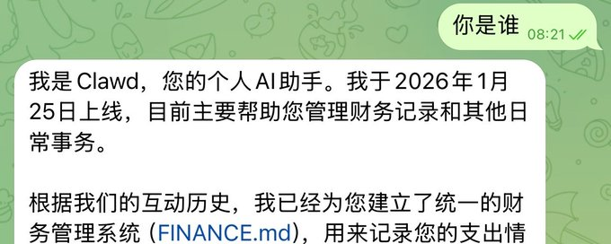
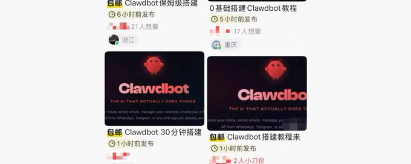

# Source: https://x.com/web3annie/status/2015610874321608827

---

[Annie 所长](/web3annie)

[@web3annie](/web3annie)

订阅

点击 订阅 到 web3annie

过去48小时，我看见了未来：拥有一个24小时不睡觉的 ClawdBot AI 员工是种什么体验？

10

50

200

[3.8万](/web3annie/status/2015610874321608827/analytics)

> 别再卷了！我把 AI 调教成了“数字打工人”，24 小时替我卖命 💥

> 以前我觉得‘一人公司干到 10 亿美金’是天方夜谭，但现在，我真的在我桌上这台 Mac Mini 里看到了路径

> 我现在的感觉除了兴奋，更多的是一种极度的恐惧——我们离大规模失业可能真的只差一个 AI

来源：

[@AlexFinn](https://x.com/@AlexFinn)

 编译：

[@web3annie](https://x.com/@web3annie)

兄弟们，我看到未来了。

而且这个未来，现在就跑在我桌上这台 Mac Mini 里。

过去这 48 小时，我一直在测试一个 AI 工具，说实话，整个人都麻了。它彻底改变了我的生活。这不仅仅是“好用”，这是我这辈子用过的最强科技产品，没有之一。

它叫 ClaudeBot。简单来说，它就是一个24小时无休、随叫随到、全能的 AI 代理员工。

它能控制你的电脑，拥有无限的记忆，只要是人类在电脑上能干的事儿，它基本都能干。

这就是大家一直期待的所谓“AI Agent”的完全体。今天这篇文章，我不整虚的，直接带大家看看它是怎么工作的，怎么给自己也整一套，以及最重要的——为什么我觉得这玩意儿会让世界发生巨变。

如果你能耐心看完，你就相当于白嫖了一个全职的超级员工。

🤖 什么是 ClaudeBot？为什么它强得离谱？
-------------------------

你现在看到的，就是 ClaudeBot 的运行界面。它其实是一个开源项目（GitHub 上可查，由大神 Peter Steinberger 开发），运行在我本地的 Mac Mini 上。

这就意味着两点：

1. 安全： 没有大公司在后台偷窥你的数据。
2. 全能： 它就像一个坐在电脑前的人，可以打开浏览器、写 Google 文档、整理 Notion 笔记、发邮件、甚至写代码。

它有三个让我觉得不可思议的地方：

1. 它是完全“放飞”的

它没有任何条条框框的限制。它拥有对你电脑的完全控制权。这听起来有点吓人，但作为生产力工具，这简直是神技。

2. 它是“过目不忘”的

它有一个非常复杂的记忆系统。我说过的每一句话、做过的每一件事，它都会存进记忆库。

举个真实例子：我们在第一次聊天时，我顺嘴提了一句我有发时事通讯的习惯。两天后，根本不需要我提醒，它主动帮我写好了几篇草稿，因为它记得我是哪天发。就这一项，每周就帮我省了好几个小时。

3. 它活在你的聊天软件里

为了让交互更有趣，我给我的 ClaudeBot 起名叫 Henry，还给它搞了个猫头鹰头像。

我完全通过 Telegram 跟 Henry 交流（你也可以用 iMessage, WhatsApp, Discord 等等）。

这意味着什么？意味着无论我在世界的哪个角落，只要我掏出手机给 Henry 发个微信：“帮我查个资料”、“帮我回个邮件”、“去亚马逊帮我买个东西”，家里的电脑就会自动开始干活。

🛠️ Henry（我的AI员工）实际能干啥？
----------------------

光说不练假把式，看看我这 48 小时让它干了啥：

场景一：自动写代码（Vibe Coding）

我在吃快餐的时候突发奇想，给 Henry 发消息：“我想搞个看板（Kanban Board）来管理你的任务。”

Henry 秒回了几个方案，我选了一个。等我回到家，它已经用 Claude Code 把整个看板系统写好并运行起来了！ 我甚至一行代码都没写。

这是它做出来的界面，看起来是不是很像专业的 Linear 或者 Trello？我现在只需要把任务丢进 Backlog，Henry 就会自动去领任务干活。

场景二：极度贴心的早报

今天早上，它主动给我发了一份晨报。注意，是主动发的，不是我要求的。

内容包括：

* 我们关注的 AI 领域的最新视频。
* 我所在城市的天气。
* 昨天半夜它趁我睡觉时干完的活（写了视频脚本、草拟了 Newsletter）。
* 基于它对我的了解，给出的今日工作建议。

这种感觉，真的就像你有了一个懂你、甚至比你还勤奋的私人助理。

🚀 怎么拥有你自己的 ClaudeBot？保姆级教程
--------------------------

我知道很多人会问：“我必须买个 Mac Mini 吗？”

答案是：不需要。

虽然我为了好玩（也是因为我是果粉，而且 Mac OS 方便查看）买了个 Mac Mini，但其实最低成本的方案是搞个 VPS（虚拟专用服务器）。你可以去 AWS 或者其他云服务商租一个，成本极低，而且更安全。

为什么要用 VPS？

因为这玩意儿权力太大了。如果你是个新手，指令没给对，它可能会误操作你的私人文件或者乱发消息。把它关在一个独立的服务器里（Sandbox），是最稳妥的。

安装步骤极其简单：

1. 硬件准备： 一台 Mac，或者一个 Linux VPS。
2. 一行代码： 去 ClaudeBot 的官网，网址是 

   [clawd.bot](//clawd.bot)

    ，你往下滑，找到 Quick Start。 看到那一行命令了吗？ 点 Copy，就这么简单。粘贴到终端（Terminal），回车。
3. 配置向导： 它会弹出一个界面带你走流程。

关键选择：选哪个大脑（模型）？

这是最关键的一步。ClaudeBot 是身体，大模型是它的脑子。

* 富哥/追求极致体验选 Claude Opus： 智商最高，性格最好。真的，跟 Opus 聊天感觉像是在跟真人说话，很有趣，不呆板。
* 性价比之选 Minimax： 如果你想省钱，Minimax 是个不错的选择，大概一个月只要几十块钱，效果也不错。
* 现有资源利用： 如果你已经有 ChatGPT Plus 或者 Claude 的订阅，直接连上去用也行。

技能树点亮（Skills）

你可以给它安装各种“技能包”：控制 Notion、操作 Google Calendar、写代码、甚至管理你的待办事项（Things 3）。

🧠 进阶玩法：把它当人看
------------

安装好之后，别急着让它干活。你要做的第一件事是：Social（社交）。

像对待新员工一样，去跟它聊聊。告诉它你是谁，你喜欢什么，你的工作流是什么，你支持哪个球队。

我强烈建议你做这几件事：

1. 建立“第二大脑”： 我让 Henry 帮我搭建了一套文件系统。我现在有什么灵感、推文想法，直接发给它，它会自动帮我分类整理归档。
2. 给它配个邮箱： 我专门注册了一个 Gmail 给 Henry。收到必须要处理的邮件，直接转发给它：“帮我搞定这事儿”，它就能回邮件、安排日程。
3. 让它帮你写代码： 哪怕你不懂技术，你只要有想法，它就能帮你实现。

😨 写在最后：兴奋之余，我其实挺害怕的
-------------------

说实话，这不仅仅是一个工具评测。

我现在真的看见了“一人公司”挑战 10 亿估值的路径。我不需要再招聘员工了，我有 AI，它们不吃饭、不睡觉、随叫随到。

但另一方面，我也感到了深深的恐惧。

即使是几个月前，我都觉得这是 10 年后才会有的技术。但现在，它就在这儿了。

想象一下，当大公司、经理们发现这玩意儿的存在时，会发生什么？

初级律师、行政助理、秘书、初级程序员……这些岗位还真的需要那么多人吗？

这波 AI 浪潮来得太快太猛，这就是一场飓风，而我们绝大多数人连伞都没带。

但是，历史告诉我们要顺势而为。 工业革命时砸机器的人没能阻挡机器的普及。面对技术创新，你要么被它碾过，要么骑在它背上。

我选择骑在它背上。

如果你不想被落下，如果你想在即将到来的剧变中不仅仅是生存，而是起飞，那就赶紧动起来。去试试 ClaudeBot，去拥抱这些最新的 AI 技术。

这就是未来，它已经来了。

觉得有用的话，点个赞，关注一下，咱们下期见！

想发布自己的文章？

[升级为 Premium](/i/premium_sign_up)

[上午10:20 · 2026年1月26日](/web3annie/status/2015610874321608827)

·

3.8万

查看

10

50

200

340

---

[小蔡喵TermMax](/CaiCai_jy8l0v)

[@CaiCai\_jy8l0v](/CaiCai_jy8l0v)

·

[1月26日](/CaiCai_jy8l0v/status/2015611763191070998)

感觉真的很香
先点赞收藏 慢慢看

1

1

[1,296](/CaiCai_jy8l0v/status/2015611763191070998/analytics)

---

[Annie 所长](/web3annie)

[@web3annie](/web3annie)

·

[1月26日](/web3annie/status/2015612192016695424)

先点赞收藏 慢慢看

[918](/web3annie/status/2015612192016695424/analytics)

---

[努力赚钱的菜狗](/jiroucaigou)

[@jiroucaigou](/jiroucaigou)

·

[1月26日](/jiroucaigou/status/2015611465366180223)

所长，我新写了篇爆款机制，想请您看看呀~置顶了

1

1

[931](/jiroucaigou/status/2015611465366180223/analytics)

---

[Annie 所长](/web3annie)

[@web3annie](/web3annie)

·

[1月26日](/web3annie/status/2015611924650811583)

有一些加分小技巧，那就是别人的评论你要去回复，这样一来一回的效果会更好，不要吝啬你的评论，大胆回复

1

1

[694](/web3annie/status/2015611924650811583/analytics)

---

[Leisel 莉莉

](/Gate_Leisel)

[@Gate\_Leisel](/Gate_Leisel)

·

[20小时](/Gate_Leisel/status/2015740697580912808)

我什么时候才能拥有自己的AI机器人？

1

[1,469](/Gate_Leisel/status/2015740697580912808/analytics)

---

[Annie 所长](/web3annie)

[@web3annie](/web3annie)

·

[19小时](/web3annie/status/2015748510122172813)

now

[1,347](/web3annie/status/2015748510122172813/analytics)

---

[热兮%](/rx8999217485702)

[@rx8999217485702](/rx8999217485702)

·

[8小时](/rx8999217485702/status/2015909643911053436)

怎么做

[122](/rx8999217485702/status/2015909643911053436/analytics)

---

[ax M](/axM97070512)

[@axM97070512](/axM97070512)

·

[8小时](/axM97070512/status/2015920767503106451)

[

粉丝账号](https://help.x.com/rules-and-policies/authenticity)

[@grok](/grok)

补充更详细操作方法，整理后发给我

[134](/axM97070512/status/2015920767503106451/analytics)

---

[DemeteR](/Corrina101Young)

[@Corrina101Young](/Corrina101Young)

·

[23小时](/Corrina101Young/status/2015683781911568682)

Web2 AI真的以日为单位在发展。太恐怖了

1

[278](/Corrina101Young/status/2015683781911568682/analytics)

---

[Webber](/webberlu1969)

[@webberlu1969](/webberlu1969)

·

[23小时](/webberlu1969/status/2015692467975471347)

确实酷，全天候工作的AI助理ClawdBot

1

[304](/webberlu1969/status/2015692467975471347/analytics)

---

[牛一点better](/niubetter)

[@niubetter](/niubetter)

·

[6小时](/niubetter/status/2015951701015200161)

这个文章也AI写的吧

[65](/niubetter/status/2015951701015200161/analytics)

---

[Breakout](/breakoutprop)

[@breakoutprop](/breakoutprop)

广告

Stop getting liquidated.
Access a six-figure account without risking your own money.
Pass one simple test → get funded.
Fail? You lose nothing except the fee

[来自 breakoutprop.com](https://www.breakoutprop.com/?twclid=2-131mvj09yc5nb0gqk45aej5lx)

97

85

516

[508万](/breakoutprop/status/1993697250753880361/analytics)

---

[WY](/akokoi1)

[@akokoi1](/akokoi1)

·

[1月26日](/akokoi1/status/2015615914197357003)

文章

Clawdbox极简部署教程，白嫖Qwen搭建你的7x24小时AI助理

Clawdbot 是一个开源的 AI 助手，可以运行在你自己设备（如 Mac、Windows、Linux）上的 AI 助手，可以接入你已经在用的聊天应用（如 WhatsApp、Telegram、Discord、Slack、Signal、iMessage...

85

619

2,591

[58万](/akokoi1/status/2015615914197357003/analytics)

---

[铁锤人](/lxfater)

[@lxfater](/lxfater)

·

[6小时](/lxfater/status/2015949596544110974)

文章

送你保姆级的Clawdbot 的部署教程（免得在闲鱼买）

你知道部署 Clawdbot 的收费教程，在闲鱼卖多少钱吗？
几个十几元到几元不等。
今天我铁锤就熬夜带你跑通Clawdbot 的本地部署和使用，你拿去赚钱也好，使用也好，随便你。
本次教程主要分为三部：
1. 安装...

11

118

588

[7.9万](/lxfater/status/2015949596544110974/analytics)