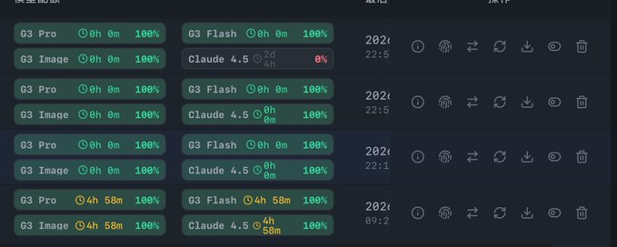
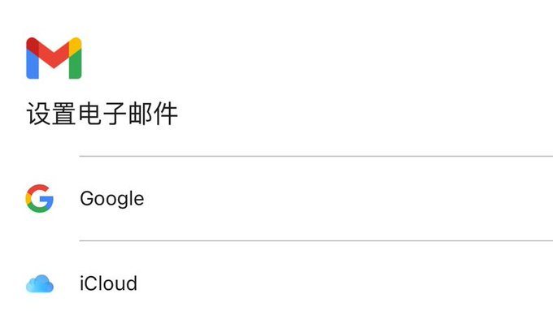
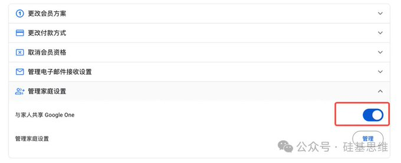

# Source: https://x.com/xiaohua_888/status/2015334909733458295?s=20

---

[1024](/xiaohua_888)

[@xiaohua\_888](/xiaohua_888)

这辈子没打过这么富裕的仗，Antigravity额度根本用不完

1

10

[1万](/xiaohua_888/status/2015334909733458295/analytics)

先说背景，我用Antigravity已经有段时间了，说实话这玩意确实好用，AI编程界的顶流工具之一，但有一个问题一直困扰着我——额度不够用。
每次看着额度见底，心里就开始盘算：这个问题要不要问？那个代码要不要让它改？整得跟省电模式似的，畏手畏脚。
Google有个家庭共享机制。首先你得有一个Pro账号，那你再注册几个Google账号，组成一个"家庭"，会员权益就能共享了。每个账号都能获得额外的5小时额度，搞个三四个账号，额度直接翻好几倍。
听着简单，但很多人卡在第一步：注册Google账号。

注册Google账号，很多人试过，各种验证码收不到，页面打不开，折腾半天搞不定。我之前也踩过这个坑，后来发现问题出在方法上。
这里说一个丝滑的方法：
用手机端的Gmail App去注册，而不是在浏览器里折腾。
先去google play 确认你主账号的地区在哪，比如我的在新加坡，这一步非常重要

具体操作是这样的：打开手机上的Gmail App，然后把你的🪜切到全局模式，节点切到和你Pro账号一样的节点。接着在Gmail里点添加账号，选择创建新账号就行了。

整个过程行云流水，没有任何卡顿，验证码也能正常收到。我用这个方法连续注册了好几个，一个都没失败。
注册完账号之后，下一步就是组建家庭了。用你的主号去发起家庭共享邀请，把新注册的这些账号都拉进来。Google的家庭最多可以有6个成员，也就是说理论上你可以有6倍的额度。

这里有个需要注意的点，你要打开“与家人共享Google One”，否则其他账号是没有会员权益的。

最后一步，用Antigravity Tools来管理这些账号。这是一个账号切换工具，可以在多个Google账号之间快速切换。用完一个账号的额度，切到下一个，无缝衔接。
说到这，可能有人会问：这不是钻空子吗？
怎么说呢，规则就摆在那里，家庭共享本来就是Google的官方功能，又不是什么灰色地带。再说了，对于真正干活的人来说，额度限制确实是个痛点。尤其是那些搞开发的、做项目的，一天下来额度根本不够用。
这个方法的本质，就是把官方提供的机制用到极致。
当然，这个技巧也不是说适合所有人。如果你就是轻度使用，偶尔问问问题，那原本的额度完全够用。
祝大家额度自由。

想发布自己的文章？

[升级为 Premium](/i/premium_sign_up)

[下午4:04 · 2026年1月25日](/xiaohua_888/status/2015334909733458295)

·

1万

查看

1

10

25

---

[1024](/xiaohua_888)

[@xiaohua\_888](/xiaohua_888)

·

[1月24日](/xiaohua_888/status/2015014114054250772)

所以现在我们同时拥有了
.claude/skills
.cursor/skills
.codex/skills
如果都能统一放到.agent/skills 多好。。。

引用

Cursor

@cursor\_ai

·

1月24日

Agent Skills are now available in Cursor.
Skills let agents discover and run specialized prompts and code.

0:11

1

5

[910](/xiaohua_888/status/2015014114054250772/analytics)