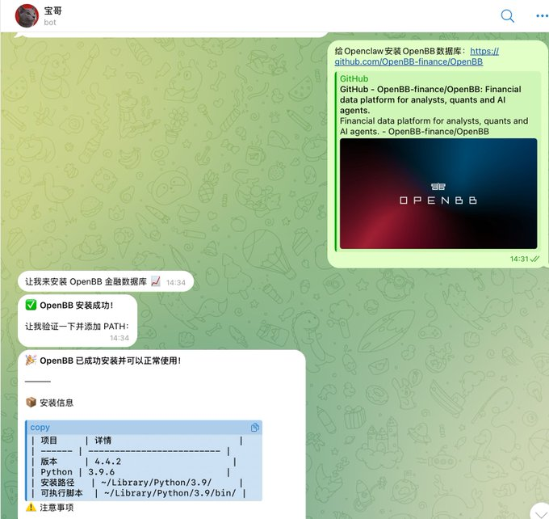
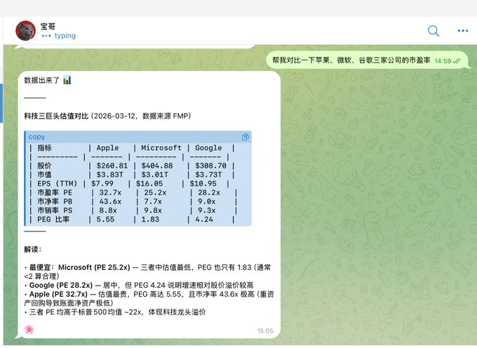
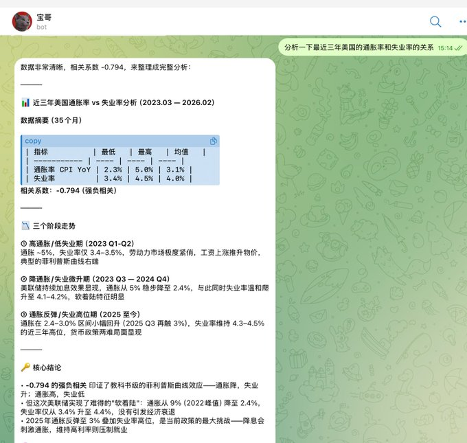
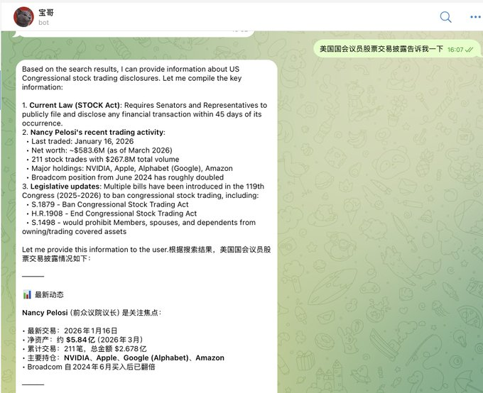
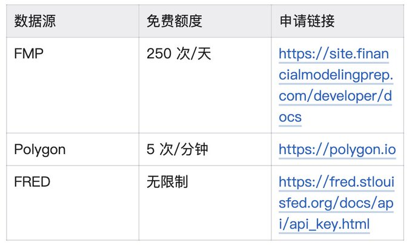

# Source: https://x.com/i/status/2032021921022529794


---

XinGPT🐶 on X: "一个免费数据库让你的龙虾成为精简版“彭博终端”" / X


[](/xingpt)

[XinGPT](/xingpt)

[@xingpt](/xingpt)

[](/xingpt/article/2032021921022529794/media/2032007793130291200)

一个免费数据库让你的龙虾成为精简版“彭博终端”

2

27

135

[16K](/xingpt/status/2032021921022529794/analytics)

最近在把我的Openclaw打造成金融助手的路途上，最头疼的就是金融数据库，尽管之前看到不少开放了易用的MCP，但商业数据库动辄一个月 200 刀+的耗费还是让人觉得肉疼，咱不能没赚钱先花钱不是。

正好在大神 

[@0xcherry](https://x.com/@0xcherry)

 的文章里发现他在用OpenBB数据库，试了一下效果还挺好，满足基础投研需求肯定是没问题了。

什么是 OpenBB？
-----------

OpenBB 是一个开源的金融数据平台，被称为“穷人版彭博终端”。它整合了近 100 个数据源，包括股票、期权、加密货币、外汇、宏观经济等各类金融数据。最关键的是——完全开源免费。

OpenBB 采用“一次连接，到处使用”的架构设计，让开发者、分析师，以及AI Agent可以通过 Python、REST API、Excel 等多种方式访问数据，非常适合接入到各类应用和工具中。

如何将 OpenBB 接入 Openclaw
----------------------

第一步：获取 GitHub 链接

访问 OpenBB 的 GitHub 仓库：

plaintext

```
https://github.com/OpenBB-finance/OpenBB
```

第二步：在 Openclaw 中配置

将 GitHub 链接直接粘贴到 Openclaw 中，告诉 Openclaw“请帮我安装”。Openclaw 会自动完成配置和安装过程，无需手动操作。

我直接把链接甩给我的龙虾“宝哥”，自动给我就装好了：

[](/xingpt/article/2032021921022529794/media/2031995104161083392)

第三步：开始提问

接入完成后，你就可以直接向 Openclaw 提问了，比如：

* “帮我查一下苹果公司的股价走势”
* “最近的美国 GDP 数据是多少？”

就这三步，简不简单！Openclaw 会自动调用 OpenBB 获取数据并给你答案。
我们来看一下OpenBB究竟提供哪些金融数据，以便更好地向他提问

OpenBB 提供的免费数据源
---------------

* 股票市场数据（Yahoo Finance）

Yahoo Finance 提供的数据包括：

* 历史股价数据（开盘价、收盘价、最高价、最低价、成交量）
* 实时报价
* 公司基本面信息
* 财务报表数据
* 股息和拆股历史
* 期权链数据

你可以问关于上市公司的一些具体问题：

* “特斯拉最近一个月的股价走势”
* “苹果公司的市盈率是多少？”
* “微软的最新财报数据”

[](/xingpt/article/2032021921022529794/media/2031996487958478848)

宏观经济数据（FRED）

美联储经济数据库（Federal Reserve Economic Data）是由美联储圣路易斯分行维护的经济数据库，包含超过 81.6 万个经济时间序列，涵盖：

* GDP、通货膨胀率、失业率
* 利率、货币供应量
* 消费者信心指数
* 房地产市场数据
* 国际贸易数据

[](/xingpt/article/2032021921022529794/media/2031996566077419520)

期权数据（CBOE）

芝加哥期权交易所（Chicago Board Options Exchange）提供：

* 期权链数据
* 隐含波动率
* 希腊字母（Greeks）
* VIX 恐慌指数

可以问：

* “今天的 VIX 指数是多少？”

[](/xingpt/article/2032021921022529794/media/2032005312740540423)

国际经济数据

OpenBB 整合了多个国际组织的免费数据源：

* IMF（国际货币基金组织）：全球经济指标
* OECD（经合组织）：发达国家经济数据
* BLS（美国劳工统计局）：就业和劳动力数据
* EIA（美国能源信息署）：能源价格和产量数据

你可以问：

* “中国的 GDP 增长率”
* “全球原油价格走势”
* “欧元区的通胀数据”

另类数据

OpenBB 还提供一些特殊的数据源：

* BizToc：商业新闻聚合
* FINRA：美国金融业监管局数据
* 国会交易数据：美国国会议员股票交易披露（比如著名的佩洛西持仓）

[](/xingpt/article/2032021921022529794/media/2032009387913658369)

* 加密货币的行情和数据

不过需要特别提醒的是，默认的yfinance数据源有限流控制，频繁请求可能触发“Too Many Requests”错误。强烈建议配置API keys！

配置API Key 的数据源：
---------------

[](/xingpt/article/2032021921022529794/media/2032005925813567493)

使用建议
----

* 请求频率控制

免费 API 通常有请求频率限制，建议合理控制查询频率，避免触发限流机制。对于高频使用场景，建议申请 API 密钥或使用付费服务。

* 数据延迟说明

免费数据源可能存在 15-20 分钟的延迟，不适合高频交易场景。如果需要实时数据，建议使用付费数据源。

* 商业用途注意事项

如果将 OpenBB 用于商业项目，需要注意各数据提供商的使用条款。某些数据源可能对商业使用有额外限制，建议购买相应的商业授权。

* 推荐配置

建议至少申请 FRED 的免费 API Key。FRED 提供无限制的免费访问，是获取宏观经济数据最稳定的选择。

总结
--

OpenBB 与 Openclaw 的结合提供了一种极其简便的金融数据获取方式。通过三步简单配置，用户就可以访问海量的金融和经济数据，无需编写代码，只需用自然语言提问即可获得专业的数据分析结果。

核心优势包括：

* 简单接入：复制链接、粘贴到 Openclaw、开始提问
* 海量数据：整合近 100 个数据源，覆盖股票、经济、加密货币、期权等多个领域
* 完全免费：核心功能无需付费，开源透明
* 零代码使用：通过自然语言交互，无需编程知识

现在就可以尝试将 OpenBB 接入 Openclaw，开启你的简洁版彭博终端吧！

进阶：命令行使用（可选）
------------

对于希望在本地环境中直接使用 OpenBB 的开发者，建议先配置独立的虚拟环境，然后让 Openclaw 调用该环境中的 OpenBB。

第一步：创建虚拟环境

首先创建一个名为 openbb-env 的 Python 虚拟环境：

bash

```
# 创建虚拟环境
python -m venv openbb-env

# 激活虚拟环境（Windows）
openbb-env\Scripts\activate

# 激活虚拟环境（macOS/Linux）
source openbb-env/bin/activate
```

第二步：安装 OpenBB

在激活的虚拟环境中安装 OpenBB：

bash

```
pip install openbb
```

启动 API 服务器

OpenBB 内置了基于 FastAPI 的 REST API 服务器，可以通过以下命令启动：

bash

```
openbb-api
```

服务器默认会在 http://127.0.0.1:6900 启动。

Python 代码示例

以下是使用 OpenBB Python SDK 的基本示例：

python

```
from openbb import obb

# 获取股票历史数据
data = obb.equity.price.historical(symbol="AAPL", provider="yfinance")
df = data.to_df()

# 获取宏观经济数据
gdp_data = obb.economy.gdp(provider="fred")

# 配置API密钥
obb.user.credentials.fred_api_key = "YOUR_API_KEY"
```

自定义 FastAPI 应用

如果需要更灵活的集成，可以创建自定义的 FastAPI 应用：

python

```
from fastapi import FastAPI
from openbb import obb

app = FastAPI(title="My Financial API")

@app.get("/stock/{symbol}")
async def get_stock(symbol: str):
    data = obb.equity.price.historical(symbol=symbol)
    return data.to_dict()
```

启动自定义应用：

bash

```
openbb-api --app /path/to/your_app.py --reload
```

这种方式适合需要将 OpenBB 集成到现有系统中的开发者，可以完全控制 API 的行为和数据处理流程。

Want to publish your own Article?

[Upgrade to Premium](/i/premium_sign_up)

[5:12 PM · Mar 12, 2026](/xingpt/status/2032021921022529794)

·

[16.8K

Views](/xingpt/status/2032021921022529794/analytics)

2

27

135

267